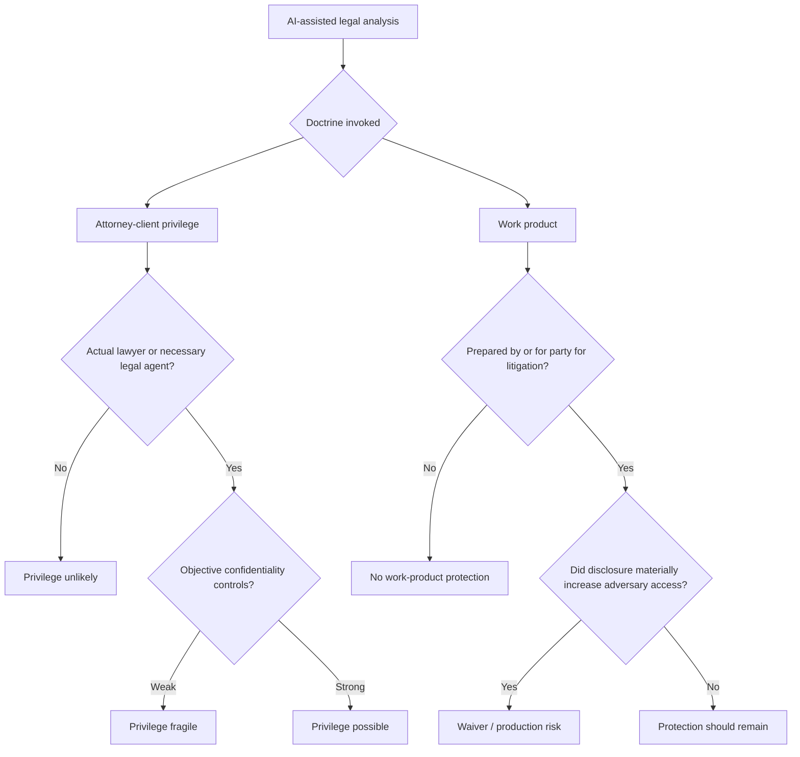

# AI Work Product, Credential Gating, and Constitutional Risk

## Executive summary

The public record does **not** yet show a mature academic literature that squarely frames the exact asymmetry you identified as a developed constitutional claim: *the same or closely related frontier model yields protected legal work when accessed through a lawyer-facing wrapper, but discoverable material when accessed by a nonlawyer through a consumer interface*. The closest **direct** source I found is Anoo D. Vyas’s April 2026 Duke Law & Technology Review article, which argues that self-represented litigants’ AI interactions should receive work-product protection and treats discoverability of AI chats as an access-to-justice problem. Closely adjacent—but less direct—are Jennifer Gundlach and Zeus Smith on extending Rule 26 work product to unrepresented litigants; Drew Simshaw on AI’s risk of entrenching a two-tier, wealth-based legal-services system; Joseph Avery, Patricia Sánchez Abril, and Alissa del Riego on constitutional, antitrust, and speech objections to lawyer-only UPL regimes in the age of generative AI; and Stephanos Bibas on AI’s potential to break the legal-services cartel. None of those sources, however, fully cashes out the *Heppner/Warner* split as an Equal Protection, Due Process, or Faretta challenge in the precise form you describe. citeturn23search1turn19view2turn19view3turn19view0turn19view4turn16search0turn17search5turn24search11

On the technology side, the official materials from entity["company","Thomson Reuters","Toronto, Ontario, Canada"], entity["company","Anthropic","San Francisco, CA, US"], entity["company","OpenAI","San Francisco, CA, US"], and entity["company","LexisNexis","New York, NY, US"] do confirm a crucial point: lawyer-facing platforms are built atop the **same general model families** used in public products. Harvey publicly states that it integrates Anthropic, Google, and OpenAI models and has rolled out Claude Opus 4.7; Anthropic states Claude Sonnet 4.6 is available on all Claude plans, Claude Cowork, the API, and major cloud platforms; Thomson Reuters says CoCounsel launched as a GPT-4-powered assistant and now combines foundation models with proprietary engineering; LexisNexis says Protégé gives secure access to OpenAI, Anthropic, and Google models inside Lexis+ AI. What the public record **does not** verify is the stronger claim that ordinary lawyer-facing use and ordinary consumer use run through literally identical deployed weights with **no** meaningful infrastructural segregation. The official materials emphasize **contracts, processor/controller status, zero-retention settings, abuse-monitoring controls, encryption, logical workspace separation, private-cloud deployment, and—only in some offerings—custom or bespoke models**. That means the “confidentiality” differential is indeed largely **governance- and deployment-layer**, not the result of a newly invented “attorney model,” but the exact topology of “same weights, no segregation” remains **unverified on public sources**. citeturn31view0turn30view4turn30view2turn30view5turn30view8turn30view7turn29view0turn29view1turn29view2turn29view3turn29view4turn29view5turn29view6turn29view7turn30view0turn32view1turn33search0turn33search1

My bottom-line assessment is that the **strongest objection is doctrinal first, constitutional second**. A pure Equal Protection challenge is likely weak because lawyers/nonlawyers and enterprise/consumer users are not suspect classes, and work-product protection is not itself a recognized fundamental right; a reviewing court would likely apply ordinary rational-basis review and accept confidentiality, accountability, malpractice exposure, and ethical duties as rational distinctions. A **due-process / access-to-courts / Faretta-inflected** challenge is more serious, especially where courts require pro se litigants to meet lawyer-like procedural demands while denying them any equivalent protected analytical workspace when they use ubiquitous AI tools. But even there, the cleanest route is probably not to constitutionalize a new right to AI secrecy. The better path is to reinterpret work-product doctrine so that protection turns on **function and confidentiality risk**, not on bar status or subscription tier. On that view, *Heppner* should be limited to attorney-client privilege and to consumer-tool use lacking reasonable confidentiality and lawyer direction, while *Warner* and *Morgan* better capture Rule 26’s text and modern litigation realities. The current framework is therefore unstable if it hardens into a bright-line credential rule, but it is salvageable if courts move toward a **confidentiality-and-function** test. citeturn14view0turn14view1turn14view2turn14view3turn14view4turn15view0turn23search1turn19view2turn35search0turn35search8turn35search12turn35search2turn35search5turn35search14turn36search1turn36search10turn36search7turn21view1

## What the sources actually say

The most **direct** source I found is Vyas’s 2026 Duke Law & Technology Review article, *Confidentiality of AI Conversations: Protecting Self-Represented Litigants Who Use ChatGPT for Legal Advice*. Vyas argues that attorney-client privilege may fail because ChatGPT is not a lawyer, that self-represented litigants should receive opinion-work-product protection for their own AI interactions, and that this should be understood as an **access-to-justice** problem. That article is the closest currently available source to the exact practical asymmetry you are targeting. citeturn23search1turn23search2turn23search3turn23search4

The strongest **foundational** doctrinal article is Gundlach and Smith’s 2022 piece, *Expanding the Federal Work Product Doctrine to Unrepresented Litigants*. It is not AI-specific, but it argues that denying work-product protection to pro se parties impedes access to justice and due process during litigation. That article is especially important because *Morgan v. V2X* expressly relied on it when holding that Rule 26(b)(3) protects at least some AI-assisted work product created by a pro se litigant. citeturn19view2turn21view3turn12view2

The next-most relevant strand is the literature on **UPL, occupational licensing, and legal-market stratification**. Avery, Abril, and del Riego’s *ChatGPT, Esq.* argues that AI-driven legal assistance intensifies constitutional and structural objections to traditional UPL rules, explicitly invoking occupational freedom, free-speech, antitrust, and anti-competitive concerns. Simshaw’s Yale Law Journal Forum essay argues that AI may entrench a **two-tiered, wealth-based system of legal services** if advanced tools remain concentrated in large-firm environments. Bibas similarly argues that AI can expand legal assistance and reduce the cost imposed by a lawyer-centered cartel. These materials do **not** directly argue that a credential-conditioned work-product rule violates Equal Protection or Faretta, but they provide the best currently available scholarly architecture for making that argument. citeturn19view0turn21view1turn20view6turn20view7turn19view3turn20view2turn20view3turn19view4turn20view0turn20view1

Policy work from the entity["organization","National Center for State Courts","Williamsburg, VA, US"] and the entity["organization","New York State Bar Association","Albany, NY, US"] reinforces the same pattern. The NCSC/TRI white paper on modernizing UPL rules treats current UPL frameworks as barriers to scalable AI legal help, and NCSC’s 2026 webinar on AI and self-represented litigants centers the reality that many pro se users are already relying on general-purpose chatbots. NYSBA’s 2026 access-to-justice report similarly frames AI as both opportunity and risk for underserved litigants. Again, these are mostly **access-and-regulation** discussions, not fully developed constitutional attacks on privilege doctrine, but they are relevant because they show that the institutional debate has already moved toward the inequality created by unequal access to secure legal AI. citeturn17search5turn17search0turn24search11

One important counterweight in the literature is Ira Robbins’s *Against an AI Privilege*. Robbins argues against creating a freestanding AI privilege and emphasizes that recognized privileges presuppose a trusted human relationship with a licensed professional. That line maps closely onto *Heppner*’s reasoning on attorney-client privilege even if it does not dispose of the separate work-product issue for pro se litigants. citeturn16search0turn14view0

## The emerging case law

The first wave of cases is already dividing along a line that is more subtle than “AI yes” versus “AI no.” The real split is between a **status-centered** approach, which makes lawyer involvement and formal confidentiality structure do most of the work, and a **function-centered** approach, which treats AI as a drafting/research tool and asks whether the use materially increased adversary access. citeturn14view0turn14view1turn14view2turn14view3turn14view4turn15view0

| Case | Court and date | Holding | Why it matters doctrinally | Sources |
|---|---|---|---|---|
| *United States v. Heppner* | S.D.N.Y., Feb. 17, 2026 opinion following Feb. 10 bench ruling | Consumer Claude materials were not protected by attorney-client privilege or work product. Judge Rakoff emphasized that Claude is not an attorney, the user lacked a reasonable expectation of confidentiality under Anthropic’s consumer policy, and the defendant acted on his own rather than at counsel’s direction. | Strongest statement for a **credential/direction/confidentiality** rule. But it arose in a criminal case and leaned heavily on attorney-client doctrine plus Second Circuit work-product formulations tied to counsel’s strategy. | citeturn12view0turn14view0turn14view1 |
| *Warner v. Gilbarco* | E.D. Mich., Feb. 10, 2026 | A pro se plaintiff could assert work-product protection for AI-assisted litigation materials. The court said waiver requires disclosure to an adversary or a materially increased chance the adversary gets the material and described ChatGPT and similar systems as “tools, not persons.” | Strongest statement for a **function-and-waiver** rule in civil litigation. The court did **not** extend attorney-client privilege, but it treated AI-assisted pro se analysis as protected work product. | citeturn13view2turn13view3turn13view4turn14view2 |
| *Morgan v. V2X* | D. Colo., Mar. 30, 2026 | The court held that Rule 26(b)(3) can protect a pro se litigant’s AI-assisted work product and that AI use does not automatically waive protection. At the same time, the court separately addressed protective-order limits on AI use for confidential discovery materials. | Most important synthesis so far. *Morgan* treats pro se litigants as “simultaneously the party and the advocate,” distinguishes *Heppner* as a criminal case, and makes clear that the open/closed-AI question can be handled through protective orders rather than blanket denial of work-product protection. | citeturn12view2turn14view3turn14view4 |
| *Jeffries v. Harcros Chemicals* | D. Kan., Mar. 25, 2026 | The court amended a protective order to restrict use of “open” AI tools even for nonconfidential discovery materials and allowed only “closed” or secure AI tools. | Shows where doctrine is likely heading operationally: not a categorical anti-AI rule, but a distinction between public/open tools and contractually controlled/secure tools for discovery materials. | citeturn15view0 |

The doctrinal structure beneath those decisions matters. Rule 26(b)(3) protects materials prepared “by or for” a party or representative in anticipation of litigation, and *Hickman v. Taylor* remains the root of the doctrine. *Morgan* correctly leaned on that text to say that a party’s own mental impressions can receive protection even if only attorneys receive the heightened version of opinion-work-product under Rule 26(b)(3)(B). *Heppner*, by contrast, drew on criminal-discovery and Second Circuit formulations more tightly linked to counsel’s role. That difference helps explain why the two opinions can be read as fact-specific rather than flatly irreconcilable. citeturn35search2turn35search5turn12view2turn14view1

A related body of law will probably shape the next stage more than constitutional law will: discovery-management doctrine. *Seattle Times v. Rhinehart* allows protective orders in discovery on a showing of good cause without heightened First Amendment scrutiny, which gives courts room to regulate how parties use “open” AI tools with produced materials. That is exactly the move seen in *Jeffries* and, more carefully, in *Morgan*. citeturn35search3turn35search14turn15view0turn12view2

The emerging pattern can be summarized like this: privilege questions are fragmenting into **two tracks**—one about whether attorney-client privilege attaches at all, and another about whether work-product protection is waived or preserved when AI is used as a drafting and analytical instrument. The first track still favors *Heppner*; the second is increasingly favoring *Warner* and *Morgan*. citeturn14view0turn14view1turn14view2turn14view3turn14view4

That framework is already implicit in the case law and in the corresponding protective-order decisions. citeturn14view1turn14view2turn14view4turn15view0

## The same models, different wrappers

The official materials establish that lawyer-facing products are not built around some wholly separate “attorney-only” species of model. Harvey says it is multi-model by design and incorporates foundation models from Anthropic, Google DeepMind, and OpenAI; Harvey’s April 2026 release notes announce Claude Opus 4.7 inside Harvey. Anthropic, in turn, states that Claude Sonnet 4.6 is available on **all Claude plans**, Claude Cowork, the API, and major cloud platforms, and that Claude Opus 4.6 is available on claude.ai, the API, and major cloud platforms. Thomson Reuters states that CoCounsel launched as the first GPT-4-powered legal AI assistant and now functions as an “execution layer” that combines foundation models, proprietary engineering, and proprietary content. LexisNexis says Protégé now provides access to models from OpenAI, Anthropic, and Google inside its secure legal environment. citeturn31view0turn30view4turn30view2turn30view3turn30view5turn30view8turn30view7

At the same time, the confidentiality differentials those vendors advertise are overwhelmingly described in **contractual, governance, and deployment** terms. Harvey publicly promises logical customer separation, zero-data-retention requirements for model providers, contractual bans on provider training, role-based access controls, regional hosting, and bespoke models only if specifically requested. Thomson Reuters says third-party partners such as OpenAI and Google are contractually prohibited from using customer data to train their models, that prompts are not stored by those third-party LLM providers, and that abuse-monitoring controls are turned off where applicable. Anthropic distinguishes consumer from commercial offerings through commercial terms, processor/controller status, default no-training for commercial data, and zero-retention agreements available for eligible APIs. OpenAI similarly says business data is not trained on by default and that custom models are used only by the purchasing customer. LexisNexis emphasizes enterprise-grade encryption, user-controlled personalization, non-use of customer data to train public models, and secure private-cloud deployment. citeturn29view0turn29view1turn34view0turn34view1turn34view2turn29view2turn29view3turn29view7turn32view1turn33search0turn30view0turn29view6turn29view4turn29view5turn27search9

That means the strongest version of the asymmetry claim is **partly verified and partly unverified**. It is verified that the same **model families** are used across consumer and enterprise/legal products. It is also verified that the confidentiality story sold to lawyers is substantially a story about **contracts, retention, access controls, processor obligations, no-training promises, and secure environments**. What is **not** publicly verified is that ordinary enterprise legal use invariably runs on the exact same deployed weights as ordinary consumer use with literally no material infrastructural differentiation; some vendors describe private-cloud, dedicated-environment, or bespoke/custom-model arrangements, and those details are product-specific. The safer statement is therefore: **the public record supports “same foundation-model families, different governance and deployment terms,” but not a universal proof of “same weights, no segregation.”** citeturn31view0turn29view0turn29view1turn29view2turn29view3turn29view4turn29view5turn29view6turn29view7turn30view0turn32view1turn27search9

| Product | Officially identified model provider(s) | Public evidence that related model family is also in consumer/public channels | Official confidentiality posture | Architectural / segregation representations in public materials | Bottom-line takeaway |
|---|---|---|---|---|---|
| Harvey | Anthropic, Google DeepMind, OpenAI; Opus 4.7 released in Harvey | Yes. Anthropic says Sonnet 4.6 is on all Claude plans and Opus 4.6 on claude.ai/API/cloud; Harvey says Opus 4.7 is live in Harvey. | No training on customer data; model providers contractually barred from training; ZDR required; logical customer separation. | Regional hosting, logical workspace separation, “sacred” separation of development from customer data; bespoke model only on request. | Public record supports **shared model family + governance/deployment controls**, not proof of identical weights for all tiers. citeturn31view0turn30view4turn30view2turn30view3turn29view0turn29view1turn34view0turn34view1 |
| CoCounsel | GPT-4 at launch; later custom OpenAI model and multi-model execution layer | Yes. CoCounsel launch/current materials tie it to GPT-4 or OpenAI-based custom models; public OpenAI products and APIs expose related model families broadly. | Thomson Reuters says user prompts/content are not used to train CoCounsel or third-party LLMs; partners contractually barred from training; prompts not stored by OpenAI/Google in cited FAQ. | “Execution layer” embedded in professional platforms; systemic controls to disable abuse monitoring where applicable. | Difference is chiefly **trusted-content layer + contractual controls + workflow integration**, not a publicly documented attorney-only base model. citeturn30view5turn30view8turn29view2turn29view3turn29view6 |
| Lexis+ with Protégé | OpenAI, Anthropic, Google; also custom/fine-tuned work with OpenAI | Yes. Lexis says Protégé gives access to those general AI models inside Lexis+ AI. | Customer data not used to train public models or improve performance for other customers; prompts/docs encrypted; external models not trained on user content. | Public materials describe secure enterprise workspace, private cloud environments, dedicated encrypted connections, and a Vault for customer docs. | Lexis publicly frames confidentiality as both **deployment architecture and governance**, but still around access to mainstream model families. citeturn30view7turn29view4turn29view5turn30view6turn27search9 |
| Consumer Claude / Claude for Work | Anthropic | Yes. Anthropic states the same model families are available across consumer plans, Claude Cowork, API, and cloud. | Consumer: model training may occur if user opts in, with longer retention. Commercial: no training by default; customer is controller; ZDR available only for eligible APIs/products using commercial API keys. | Public materials emphasize terms, retention settings, controller/processor roles, and API-based zero retention; they do not publicly describe a distinct “lawyer model.” | The clearest example of the **terms-and-controls** distinction between public and enterprise/confidential channels. citeturn30view0turn30view2turn30view3turn29view7turn32view1turn33search0turn33search1turn33search8 |

## Constitutional assessment

A classic **Equal Protection** claim is the hardest sell. Lawyers and nonlawyers are not suspect or quasi-suspect classes, and there is no recognized fundamental right to have work-product protection attach to one’s preferred research technology. A federal court would therefore almost certainly begin with ordinary rational-basis review, and under *Williamson v. Lee Optical* that review is famously forgiving. The state or court could argue that licensed lawyers are subject to professional discipline, malpractice exposure, fiduciary duties, confidentiality rules, and supervision duties that consumer users are not; that line is likely enough to survive standard Equal Protection scrutiny even if it is underinclusive or overinclusive. In that sense, a pure “same model, same result, therefore equal protection violation” argument is probably weak. citeturn36search1turn14view0turn39search1turn39search17

The **Due Process / access-to-courts** argument is more promising. Gundlach and Smith expressly connect denial of work-product protection for unrepresented litigants to diminished fair treatment and due process during litigation, and *Morgan* echoed that logic in the AI setting by stressing that pro se litigants face the same substantive and procedural standards as represented parties and should receive corresponding protections. If courts permit counsel to use secure AI systems as normal litigation instruments but deny any analogous protected space to self-represented parties using equivalent tools, a litigant can argue that the process has ceased to be meaningfully evenhanded. That argument grows stronger in cases where AI is not a luxury, but the only realistic substitute for unaffordable counsel. citeturn21view3turn14view3turn14view4turn23search1turn24search11

A **Faretta-based** argument is serious but still limited. *Faretta* protects a criminal defendant’s right personally to decide whether counsel is to his advantage and to proceed pro se; it does not clearly guarantee all the tactical or infrastructural advantages that a licensed lawyer would possess. That is the main weakness. The counterpoint, however, is that once AI becomes a routine instrument for legal reasoning, drafting, and strategic organization, denying self-represented defendants any protected zone for AI-assisted trial preparation risks hollowing out the self-representation right in practice. *Morgan*’s formulation—that a pro se litigant is simultaneously party and advocate—captures that practical point even though *Morgan* was civil, not criminal. So the Faretta claim is **not frivolous**, but it is better characterized as a structural argument about not making self-representation illusory than as a slam-dunk Sixth Amendment entitlement to AI confidentiality. citeturn35search0turn35search8turn35search12turn14view3turn14view4turn14view1

The stronger constitutional flank may actually lie **outside** privilege doctrine, in attacks on AI-exclusionary legal-market rules. *ChatGPT, Esq.* argues that UPL rules now collide with occupational freedom, free-speech doctrine, and antitrust principles because AI can perform core legal tasks once reserved to licensed attorneys. The article also relies on *Sperry*—where the Supreme Court recognized that nonlawyers may in some settings provide legal services—and on the broader constitutional debate over occupational freedom that extends well beyond legal practice. Combined with *North Carolina Board of Dental Examiners v. FTC* and *Edwards v. District of Columbia*, that body of law suggests that if courts or bars try to reserve AI-mediated legal cognition to lawyers alone, the more potent constitutional and structural objections may come through **speech, antitrust, and occupational liberty**, not through equal-protection doctrine standing alone. citeturn20view7turn21view1turn20view6turn36search7turn36search10turn38search1

My candid judgment, then, is this: the **constitutional case has real normative force but uneven doctrinal force**. Equal Protection is weakest. Due Process / access to justice is stronger. Faretta gives the argument moral and structural punch, especially in criminal cases, but probably not decisive force by itself. The most likely successful route is **constitutional avoidance through doctrinal reform**: courts can reinterpret work-product protection to avoid making legal privacy turn on wealth, license status, or product tier. That is a much easier move than announcing a new constitutional rule. citeturn14view1turn14view2turn14view3turn14view4turn23search1turn19view2

## Recommended doctrinal framework

The best rule, in my view, is a **confidentiality-and-function test**. Work-product protection should turn on what the AI was doing in the litigation process and whether the way it was used materially increased adversary access—not on whether the user is bar-admitted or paying for a premium legal wrapper. That approach is more faithful to Rule 26’s text, better aligned with *Hickman*, and more adaptable to a world in which both represented and self-represented parties use AI as a drafting and reasoning instrument. citeturn35search1turn35search2turn35search5turn14view2turn14view3turn14view4

A workable test would ask five questions. First, was the material prepared **by or for a party** in anticipation of litigation or for trial? Second, was the AI acting as a **tool of analysis, drafting, organization, or retrieval**, rather than as a social recipient of confidences? Third, what objective confidentiality safeguards existed—training bans, retention limits, deletion rights, no-human-review commitments, processor terms, private-cloud deployment, or logical segregation? Fourth, did the use of the AI materially increase the likelihood the adversary would obtain the material absent legal compulsion? Fifth, if attorney-client privilege rather than work product is claimed, was the AI use sufficiently integrated into an actual lawyer-client relationship or its necessary agency structure to preserve that privilege? citeturn35search2turn14view1turn14view2turn14view4turn29view0turn29view2turn29view4turn29view6turn29view7

Under that test, *Heppner* probably still comes out against **attorney-client privilege**, because the defendant used consumer Claude on his own initiative, outside lawyer direction, under consumer terms the court found inconsistent with reasonable confidentiality. But the same framework would also explain why *Warner* and *Morgan* correctly protected pro se AI-assisted materials as work product. A party’s own litigation analysis should not become discoverable merely because the party used software to structure it. The key waiver question is not whether data technically touched a third party, but whether the disclosure made adversary acquisition materially more likely. citeturn14view0turn14view1turn14view2turn14view4

That framework also fits the operational lessons of *Jeffries* and the post-2025 vendor ecosystem. Courts can and should differentiate between **open/public** and **closed/contractually controlled** systems for discovery materials and confidential productions. A protective order can require no-training clauses, deletion rights, and secure environments without making work-product turn on the lawyer/nonlawyer divide. That gives courts a narrower and more administrable way to police risk. citeturn15view0turn35search14turn29view0turn29view2turn29view4turn29view6

If courts refuse that route and instead formalize a rule under which an attorney’s prompt through Harvey or CoCounsel is protected while a nonlawyer’s materially identical prompt through consumer Claude or ChatGPT is categorically discoverable, I do not think that framework is durable. It would be out of sync with the text of Rule 26, unstable across civil and criminal contexts, vulnerable to access-to-justice criticism, and increasingly hard to justify as vendors themselves market the same frontier model families across consumer, enterprise, and professional channels. Courts will feel pressure either to harden around an **open-versus-closed tool distinction** or to move toward a factor-based inquiry. A simple credential bright line is the least sustainable of the available options. citeturn35search2turn14view3turn15view0turn31view0turn30view2turn30view5turn30view7

## Prioritized bibliography

### Primary sources

- *United States v. Heppner*, S.D.N.Y. opinion and bench-ruling explanation. citeturn12view0turn14view0turn14view1
- *Warner v. Gilbarco*, E.D. Mich. order denying production of pro se plaintiff’s AI-assisted materials. citeturn12view1turn13view2turn14view2
- *Morgan v. V2X*, D. Colo. order on pro se AI work product and protective-order issues. citeturn12view2turn14view3turn14view4
- *Jeffries v. Harcros Chemicals*, D. Kan. amended protective-order decision distinguishing “open” and “closed” AI tools. citeturn15view0
- Fed. R. Civ. P. 26(b)(3) and *Hickman v. Taylor*. citeturn35search2turn35search1turn35search5
- *Faretta v. California* and the Sixth Amendment right of self-representation. citeturn35search0turn35search8turn35search12
- *Seattle Times v. Rhinehart* on protective orders and discovery. citeturn35search3turn35search14
- Harvey security page, platform agreement, privacy/security blog posts, and model-release posts. citeturn29view0turn29view1turn34view0turn34view1turn31view0turn30view4
- Anthropic consumer/commercial privacy and model-availability materials. citeturn30view0turn29view7turn32view1turn33search0turn33search1turn30view2turn30view3
- Thomson Reuters CoCounsel product, press, and security materials. citeturn30view5turn30view8turn29view2turn29view3turn26search4
- OpenAI enterprise privacy commitments. citeturn29view6turn6search3turn6search0
- LexisNexis Protégé and Lexis+ AI security/privacy materials. citeturn30view7turn29view4turn29view5turn27search9

### Major academic and policy materials

- Anoo D. Vyas, *Confidentiality of AI Conversations: Protecting Self-Represented Litigants Who Use ChatGPT for Legal Advice* (2026). citeturn23search1turn23search2turn24search1
- Jennifer A. Gundlach & Zeus Smith, *Expanding the Federal Work Product Doctrine to Unrepresented Litigants* (2022). citeturn19view2turn21view3
- Drew Simshaw, *Interoperable Legal AI for Access to Justice* (2025). citeturn19view3turn20view2turn20view3
- Joseph J. Avery, Patricia Sánchez Abril & Alissa del Riego, *ChatGPT, Esq.: Recasting Unauthorized Practice of Law in the Era of Generative AI* (2025). citeturn19view0turn21view1turn20view6turn20view7
- Stephanos Bibas, *Lawyers’ Monopoly and the Promise of AI* (2025). citeturn19view4turn20view0turn20view1
- Ira P. Robbins, *Against an AI Privilege* (2025). citeturn16search0
- NCSC/TRI, *Modernizing Unauthorized Practice of Law Regulations to Enable AI and Expand Access to Justice* (policy white paper). citeturn17search5
- NCSC/TRI webinar, *AI Tools, Self-Represented Litigants & the Future of Access to Justice* (2026). citeturn17search0
- NYSBA, *Report and Recommendations on Artificial Intelligence and Access to Justice in 2025* (2026). citeturn24search11
- ABA Formal Opinion 512 and related ethics guidance emphasizing confidentiality and terms-of-use review for lawyers using generative AI. citeturn39search1turn40search6turn40search9

----
Sources

Activity · 44m

Citations · 27

dltr.law.duke.edu
dltr.law.duke.edu

1
https://dltr.law.duke.edu/2026/04/17/confidentiality-of-ai-conversations-protecting-self-represented-litigants-who-use-chatgpt-for-legal-advice/
https://dltr.law.duke.edu/2026/04/17/confidentiality-of-ai-conversations-protecting-self-represented-litigants-who-use-chatgpt-for-legal-advice/
harvey.ai
harvey.ai

2
https://www.harvey.ai/blog/why-harvey-is-multi-model-by-design
https://www.harvey.ai/blog/why-harvey-is-multi-model-by-design

14
https://www.harvey.ai/security
https://www.harvey.ai/security
hrlegalist.com
hrlegalist.com

3
https://www.hrlegalist.com/wp-content/uploads/sites/4/2026/03/1-United-States-v.-Heppner.pdf
This is an early example of how the lowest level of scrutiny, rational basis review, applies to challenges to economic regulations. Private parties seeking ...Read more

8
https://www.hrlegalist.com/wp-content/uploads/sites/4/2026/03/1-United-States-v.-Heppner.pdf
https://www.hrlegalist.com/wp-content/uploads/sites/4/2026/03/1-United-States-v.-Heppner.pdf
law.georgetown.edu
law.georgetown.edu

4
https://www.law.georgetown.edu/poverty-journal/wp-content/uploads/sites/25/2023/01/Expanding-the-Federal-Work-Product-Doctrine-to-Unrepresented-Litigants.pdf
https://www.law.georgetown.edu/poverty-journal/wp-content/uploads/sites/25/2023/01/Expanding-the-Federal-Work-Product-Doctrine-to-Unrepresented-Litigants.pdf
yjolt.org
yjolt.org

5
https://yjolt.org/sites/default/files/avery_abril_delriego_26yalejltech64.pdf
https://yjolt.org/sites/default/files/avery_abril_delriego_26yalejltech64.pdf

20
https://yjolt.org/sites/default/files/avery_abril_delriego_26yalejltech64.pdf
The FTC alleged that the Board's concerted action to exclude nondentists from the market for teeth whitening services in North Carolina constituted an ...Read more
ncsc.org
ncsc.org

6
https://www.ncsc.org/sites/default/files/media/document/AI_UPL_WhitePaper.pdf
https://www.ncsc.org/sites/default/files/media/document/AI_UPL_WhitePaper.pdf

25
https://www.ncsc.org/event/ai-tools-self-represented-litigants-future-access-justice
https://www.ncsc.org/event/ai-tools-self-represented-litigants-future-access-justice
jolt.law.harvard.edu
jolt.law.harvard.edu

7
https://jolt.law.harvard.edu/digest/against-an-ai-privilege
https://jolt.law.harvard.edu/digest/against-an-ai-privilege
damiencharlotin.com
damiencharlotin.com

9
https://www.damiencharlotin.com/documents/1977/Warner_v._Gilbarco_USA_10_February_2026.pdf
https://www.damiencharlotin.com/documents/1977/Warner_v._Gilbarco_USA_10_February_2026.pdf

10
https://www.damiencharlotin.com/documents/1975/Morgan_v._V2X_USA_30_March_2026.pdf
https://www.damiencharlotin.com/documents/1975/Morgan_v._V2X_USA_30_March_2026.pdf
ecf.ksd.uscourts.gov
ecf.ksd.uscourts.gov

11
https://ecf.ksd.uscourts.gov/cgi-bin/show_public_doc?2025cv2352-152=
https://ecf.ksd.uscourts.gov/cgi-bin/show_public_doc?2025cv2352-152=
law.cornell.edu
law.cornell.edu

12
https://www.law.cornell.edu/rules/frcp/rule_26
https://www.law.cornell.edu/rules/frcp/rule_26

13
https://www.law.cornell.edu/supremecourt/text/467/20
https://www.law.cornell.edu/supremecourt/text/467/20

19
https://www.law.cornell.edu/supremecourt/text/422/806
https://www.law.cornell.edu/supremecourt/text/422/806

21
https://www.law.cornell.edu/supremecourt/text/329/495
https://www.law.cornell.edu/supremecourt/text/329/495
thomsonreuters.com
thomsonreuters.com

15
https://www.thomsonreuters.com/en/press-releases/2024/november/thomson-reuters-cocounsel-tests-custom-llm-from-openai-broadening-its-multi-model-product-strategy
https://www.thomsonreuters.com/en/press-releases/2024/november/thomson-reuters-cocounsel-tests-custom-llm-from-openai-broadening-its-multi-model-product-strategy
lexisnexis.com
lexisnexis.com

16
https://www.lexisnexis.com/en-us/products/protege.page
https://www.lexisnexis.com/en-us/products/protege.page
anthropic.com
anthropic.com

17
https://www.anthropic.com/news/updates-to-our-consumer-terms
https://www.anthropic.com/news/updates-to-our-consumer-terms
supreme.justia.com
supreme.justia.com

18
Williamson v. Lee Optical, Inc. | 348 U.S. 483 (1955)
This is an early example of how the lowest level of scrutiny, rational basis review, applies to challenges to economic regulations. Private parties seeking ...Read more
openai.com
openai.com

22
https://openai.com/enterprise-privacy/
https://openai.com/enterprise-privacy/
yalelawjournal.org
yalelawjournal.org

23
https://yalelawjournal.org/pdf/SimshawYLJForumEssay_omw1vdsn.pdf
https://yalelawjournal.org/pdf/SimshawYLJForumEssay_omw1vdsn.pdf

24
https://yalelawjournal.org/pdf/BibasYLJForumEssay_wqfd4582.pdf
https://yalelawjournal.org/pdf/BibasYLJForumEssay_wqfd4582.pdf
nysba.org
nysba.org

26
https://nysba.org/wp-content/uploads/2026/01/Revised-01.20.2026-Approved-Report-and-Recommendations-on-AI-and-Access-to-Justice-in-2025-online-version.pdf?srsltid=AfmBOorPRgF4BZbJag1G1d0fGOxQ8yp20owgxQJATFIi2ysdpUD3gzL9
https://nysba.org/wp-content/uploads/2026/01/Revised-01.20.2026-Approved-Report-and-Recommendations-on-AI-and-Access-to-Justice-in-2025-online-version.pdf?srsltid=AfmBOorPRgF4BZbJag1G1d0fGOxQ8yp20owgxQJATFIi2ysdpUD3gzL9
americanbar.org
americanbar.org

27
https://www.americanbar.org/news/abanews/aba-news-archives/2024/07/aba-issues-first-ethics-guidance-ai-tools/
https://www.americanbar.org/news/abanews/aba-news-archives/2024/07/aba-issues-first-ethics-guidance-ai-tools/
Sources scanned · 476

hrlegalist.com
hrlegalist.com
United States v. Heppner, No. 25 Cr. 503 (JSR), 2026 BL ...

Apr 6, 2026 — On February 6, 2026, the Government moved, in writing, for a ruling that the AI Documents are protected by neither the attorney-client privilege ...Read more
damiencharlotin.com
damiencharlotin.com
Case 2:24-cv-12333-GAD-APP ECF No. 94, PageID.1009 ...

Feb 10, 2026 — SOHYON WARNER,. Plaintiff, v. GILBARCO, INC., GILBARCO, INC. (d/b/a GILBARCO VEEDER-ROOT), and. VONTIER CORPORATION ...Read more
Case No. 1:25-cv-01991-SKC-MDB Document 65 filed 03/ ...

Mar 30, 2026 — This dispute raises two such questions: (1) to what extent will work product protections apply to a pro se litigant's use of AI, and (2) to what ...Read more
anthropic.com
anthropic.com
Updates to Consumer Terms and Privacy Policy

Aug 28, 2025 — We are also extending data retention to five years, if you allow us to use your data for model training. This updated retention length will only ...Read more
Anthropic Economic Index report: Economic primitives

Jan 15, 2026 — This report introduces new metrics of AI usage to provide a rich portrait of interactions with Claude in November 2025, just prior to the ...
Anthropic's Frontier Safety Roadmap

For many reasons - preventing theft or sabotage of our models, ensuring adherence to Claude's Constitution, and ensuring that our model training hasn't been ...Read more
Writing effective tools for AI agents—using ...

Sep 11, 2025 — With your early prototype, Claude Code can quickly explore your tools and create dozens of prompt and response pairs. Prompts should be inspired ...Read more
Introducing Claude Opus 4.7

4 days ago — We are releasing Opus 4.7 with safeguards that automatically detect and block requests that indicate prohibited or high-risk cybersecurity uses.
Introducing Claude Sonnet 4.6

Feb 17, 2026 — Claude Sonnet 4.6 is available now on all Claude plans, Claude Cowork, Claude Code, our API, and all major cloud platforms. We've also upgraded ...Read more
Claude Opus 4.7

NEW. Claude Opus 4.7. Apr 16, 2026 · Claude Opus 4.6. Feb 5, 2026. Claude Opus 4.6 is our most capable model to date. · Claude Opus 4.5. Nov 24, 2025. Claude Opus ...
Claude Sonnet 4.6

Anyone can chat with Claude using Sonnet 4.6 on Claude.ai, available on web, iOS, and Android. For developers interested in building agents, Sonnet 4.6 is ...Read more
Introducing Claude Design by Anthropic Labs

3 days ago — Introducing Claude Opus 4.7. Our latest Opus model brings stronger performance across coding, agents, vision, and multi-step tasks, with greater ...
Model system cards

Model System Cards ; Claude Opus 4.6, February 2026, Read system card ; Claude Opus 4.5, November 2025, Read system card ; Claude Haiku 4.5, October 2025, Read ...
Claude Sonnet 4.6 System Card

Feb 17, 2026 — Claude Sonnet 4.6 was trained on a proprietary mix of publicly available information from the internet up to May 2025, non-public data from ...Read more
Introducing Claude Opus 4.6

Feb 5, 2026 — Claude Opus 4.6 is available today on claude.ai, our API, and all major cloud platforms. If you're a developer, use claude-opus-4-6 via the ...Read more
Newsroom

Introducing Claude Opus 4.7. Product Apr 16, 2026. Our latest Opus model brings stronger performance across coding, agents, vision, and ...
Anthropic's Transparency Hub

Jan 29, 2026 — Internal model evaluations are performed within our own infrastructure, while external evaluations use API access with 'zero data retention' ...Read more
Anthropic's Responsible Scaling Policy

Apr 2, 2026 — Stay informed about the latest Claude RSP (Responsible Scaling Policy) updates and improvements. Learn how Anthropic maintains safety and ...
Anthropic Economic Index report: Uneven geographic and ...

Sep 15, 2025 — The geography of AI adoption. For the first time, we release geographic cuts of Claude.ai usage data across 150+ countries and all U.S. states.Read more
openai.com
openai.com
Enterprise privacy at OpenAI

Jan 8, 2026 — By default, we do not use your business data for training our models. If you have explicitly opted in to share your data with us (for example, ...Read more
How your data is used to improve model performance

Mar 13, 2026 — Once you opt out, new conversations will not be used to train our models. ... Please see our Enterprise Privacy page for information on how we ...Read more
Terms of Use

Jan 1, 2026 — ... Content. Opt out. If you do not want us to use your Content to train our models, you can opt out by following the instructions in this article⁠.Read more
Privacy policy

Feb 6, 2026 — Read our instructions⁠(opens in a new window) on how you can opt out of our use of your Content to train our models. 3. Disclosure of Personal ...Read more
How we're responding to The New York Times' data ...

Jun 5, 2025 — Update on October 22, 2025: After months of litigation, we are no longer under a legal order to retain consumer ChatGPT and API content ...Read more
New tools for building agents

Mar 11, 2025 — We're launching a new set of APIs and tools specifically designed to simplify the development of agentic applications.Read more
OpenAI raises $122 billion to accelerate the next phase of AI

Mar 31, 2026 — OpenAI raises $122 billion in new funding to expand frontier AI globally, invest in next-generation compute, and meet growing demand for ...
Testimony before the U.S. Senate

Jun 22, 2023 — While some of the information we use to train our models may include personal information that is available on the public internet, we work ...Read more
ChatGPT

ChatGPT is your AI chatbot for everyday use. Chat with the most advanced AI to explore ideas, solve problems, and learn faster.
API Pricing

Explore OpenAI API pricing for GPT-5.4, multimodal models, and tools. Compare token costs, realtime, image, and video pricing, plus service tiers.
Introducing shopping research in ChatGPT

Nov 24, 2025 — Today, we're introducing shopping research, a new experience in ChatGPT that does the research for you to help you find the right products.Read more
Business data privacy, security, and compliance

OpenAI is trusted by OpenAI security and privacy. We don't train our models on your organization's data by default.Read more
Security and privacy at OpenAI

We don't train our models on your organization's data by default. Enhanced data retention controls help you stay compliant. We protect your data with ...Read more
debevoise.com
debevoise.com
SDNY Rules AI-Generated Documents Are Not Protected ...

Feb 12, 2026 — Judge Rakoff issued an oral ruling that neither the attorney-client privilege nor the work product doctrine protected the AI-generated documents ...Read more
blankrome.com
blankrome.com
Business Litigation AI, Privilege, and Work Product

Mar 17, 2026 — The Court reasoned that AI platforms are “tools, not persons,” that a waiver of work-product protections requires disclosure to an adversary ...Read more
AI, Privilege, and Work Product: Conflicting Federal ...

Mar 17, 2026 — The Court reasoned that AI platforms are “tools, not persons,” that a waiver of work-product protections requires disclosure to an adversary ( ...
privacy.anthropic.com
privacy.anthropic.com
Does Anthropic Act as a Data Processor or Controller?

When a commercial customer creates a Claude for Work account (Team or Enterprise ... Is my data used for model training? I have a zero data retention agreement ...Read more
What personal data is collected when using dictation on the ...

This article is about our consumer products such as Claude Free, Pro, Max and when accounts from those plans use Claude Code. For our commercial products ...Read more
I have a zero data retention agreement with Anthropic. What ...

Under these agreements, the only products to which zero data retention applies are eligible Anthropic APIs, and Anthropic products that use your Commercial ...Read more
Who owns and manages the data of my team?

This article provides important information about your Claude for Work account associated with your organization's Claude for Work plan (Team or Enterprise ...Read more
Can you delete data sent via Claude? - Anthropic Privacy Center

You have control to delete your conversations, which will be immediately deleted from your conversation history and automatically deleted from our back-end ...Read more
harvardlawreview.org
harvardlawreview.org
United States v. Heppner

Mar 23, 2026 — On February 6, 2026, the Government moved for a ruling that the AI documents were not protected by attorney-client privilege or the work product ...Read more
Edwards v. District of Columbia

Dec 10, 2014 — District of Columbia, the D.C. Circuit held unconstitutional the District of Columbia's tour-guide licensing regulation, which required all ...Read more
When Rational Basis Review Bit

May 12, 2025 — Carolene Products Co. — which established rational basis review — and Williamson v. Lee Optical of Oklahoma, Inc. — which redefined ...Read more
North Carolina State Board of Dental Examiners v. FTC

Nov 10, 2015 — The Board moved to dismiss, claiming that, as a state agency, it was protected by state-action antitrust immunity. ... The FTC denied the motion.Read more
bowditch.com
bowditch.com
Further Clarification on the Discoverability of AI Output

The Warner court reasoned that AI platforms are “tools, not people,” and that the pro se civil plaintiff's use of AI was protected as work ...Read more
help.openai.com
help.openai.com
How your data is used to improve model performance

Once you opt out, new conversations will not be used to train our models. ... Please see our Enterprise Privacy page for information on how we handle business ...Read more
Data Controls FAQ

Refer to our article: How your data is used to improve model performance ... Aren't used to train our models. May be reviewed only to monitor for abuse.Read more
What if I want to keep my history on but disable model ...

To do so, please navigate to Your Profile > Settings > Data Controls > Improve the model for everyone > Switch off the toggle. Once you opt out, new ...Read more
ChatGPT agent

Business, Enterprise, and Edu plans. By default, we do not use your business data for training our models, including data accessed during agent mode sessions.Read more
ChatGPT Atlas for Enterprise

No. Atlas does not use Business or Enterprise content to train OpenAI models. Can we use Atlas with regulated data such as PHI or payment card data?Read more
Data Usage for Consumer Services FAQ

Commonly asked questions about how we treat user data for OpenAI's non-API consumer services like ChatGPT.
What is ChatGPT?

... Data Controls FAQ. Once you opt out, new conversations will not be used to train our models. We don't use content from our business offerings such as ...Read more
Managing data, sharing, and privacy in ChatGPT Business

Apr 4, 2026 — Business data is excluded from training by default and is encrypted in transit and at rest. In a ChatGPT Business workspace, each user has their ...Read more
Memory FAQ

Do you train your models with memories? If you have the “Improve the model ... You can turn this setting off anytime in your Data Controls. As always ...Read more
File Uploads FAQ

To learn more about data controls, see Data Controls FAQ. Once you delete ... Will OpenAI use files uploaded to train its models? The answer depends on ...Read more
ChatGPT — Release Notes

Apr 10, 2026 — Higher message limits for GPT-4. We're doubling the number of messages ChatGPT Plus customers can send with GPT-4. Rolling out over the next ...Read more
paulweiss.com
paulweiss.com
SDNY Court Considers Whether AI-Generated Documents ...

Feb 20, 2026 — Judge Rakoff's ruling in the case, U.S. v. Heppner, appears to be the first in which a court determined that interactions with a publicly ...Read more
Federal Courts Reach Different Outcomes on Whether AI ...

Mar 25, 2026 — In Warner, the court's conclusion that AI programs “are tools, not persons” supported a finding that work product protection was not waived. In ...Read more
AI Tools, Privilege, and Work Product: Recent Court ...

Mar 12, 2026 — They come out one finding no privilege, that's the Rakoff decision, the Heppner case, and one finding that there is privilege to certain of ...Read more
Court Extends Protective Order's AI Restrictions to All ...

6 days ago — Jeffries is an important precedent because it extends AI restrictions in a protective order to all discovery materials—not just those designated.Read more
community.openai.com
community.openai.com
ChatGPT Team - are chats really not used to train models?

Feb 4, 2024 — The response data only indicates that “training is allowed”, but in reality it's not being used as training data.Read more
Are chats with GPTs created by business/team users used ...

Apr 23, 2024 — If the user of the GPT is on a Teams or Enterprise account then, by default, the chats with that GPT will not be used for training purposes.Read more
Using Private Company Data with OpenAI / ChatGPT

Nov 6, 2023 — OpenAI does not use data from API calls for training. More here. 2 ... I doubt we will be using the Enterprise version, but looks like ...Read more
Training in the Plus plan

Jan 15, 2024 — So do I get it correctly that with the introduction of Team plan, it is now impossible to restrict your data from being used for training?
OpenAI injecting a date into the prompt breaks evaluations

Feb 12, 2026 — A simplified example: I gave the system prompt “Behave as though today's date is 2026-02-06.” to four different models (low reasoning) to tell ...Read more
Deprecation of chat-gpt-4o-latest

Nov 21, 2025 — Note: chatgpt-4o-latest never was given enough features or rate limit to develop API products with it. It was for “experimentation”. 2 Likes.Read more
chapman.com
chapman.com
Federal Court Rules That AI-Generated Documents Are ...

Feb 16, 2026 — Heppner, 25-cr-00503-JSR, ruled on February 10, 2026 that documents generated through a public AI platform were not protected by the attorney- ...Read more
haynesboone.com
haynesboone.com
Generative AI in Litigation: Are Prompts, Outputs and AI

7 days ago — Artificial intelligence is rapidly transforming litigation practice—reshaping how cases are investigated, analyzed and litigated.Read more
scholarcommons.sc.edu
scholarcommons.sc.edu
Real Responsibility for Artificial Intelligence

by K Swisher · 2023 · Cited by 14 — While this work includes the use of AI as a tool in legal practice, the focus is far beyond: when AI functionally becomes counsel, not simply a human lawyer's ...Read more
Hybrid Representation and Standby Counsel

by JL Howard · 2001 — Also, the court has suggested that a court may terminate a defendant's right to self-representation when the defendant engages in disruptive behavior. Faretta, ...Read more
yalelawjournal.org
yalelawjournal.org
Lawyers' Monopoly and the Promises of AI

Mar 14, 2025 — Part I of this Essay advocates increasing access to justice ... Clerks of court should lend a hand too. 4. BENJAMIN H. BARTON & STEPHANOS BIBAS, ...Read more
Artificial Intelligence

Lawyers' Monopoly and the Promises of AI · Stephanos Bibas. Access to justice in American civil courts won't come through free or pro bono lawyers. To drive ...Read more
Access to Justice

Lawyers' Monopoly and the Promises of AI · Stephanos Bibas. Access to justice in American civil courts won't come through free or pro bono lawyers. To drive ...Read more
Stephanos Bibas

Lawyers' Monopoly and the Promises of AI · Stephanos Bibas. Access to justice in American civil courts won't come through free or pro bono lawyers. To drive ...Read more
Interoperable Legal AI for Access to Justice

See Stephanos Bibas, Lawyers' Monopoly and the Promise of AI, 134 Yale L.J.F. 920, 920-22 (2025) (exploring the relationship between jurisdictional ...Read more
Interoperable Legal AI for Access to Justice

Mar 14, 2025 — The inverse is true as well—progress in the courts will be meaningless if lawyers or litigants are unable to access or use AI tools effectively.Read more
Lawyers' Monopoly and the Promises of AI

Mar 14, 2025 — The Essays analyze rural criminal defense challenges, administrative rulemaking responsibilities, and the role of technology in improving access ...
Constructing AI Speech

Apr 22, 2024 — This Essay advocates for a “legal construction of technology” approach to AI speech, challenging the notion that technology disrupts law and ...
Search

Interoperable Legal AI for Access to Justice | Yale Law Journal. sanctioned-using-fake-chatgpt-cases-legal-brief-2023-06-22 https://perma.cc/H5RX-RMTA. 36 ...
Legal Deserts and Spatial Injustice: A Study of Criminal ...

Legal Deserts and Spatial Injustice: A Study of Criminal Legal Systems in Rural Washington | Yale Law Journal ... Interoperable Legal AI for Access to Justice.Read more
The Due Process Right To Pursue a Lawful Occupation

Dec 5, 2016 — Bernstein, The Due Process Right to Pursue a Lawful Occupation: A Brighter Future Ahead?, 126 Yale L.J. F. 287 (2016), www.yalelawjournal.com/ ...Read more
The Constitutional Status of Tort Law: Due Process and the ...

Dec 19, 2005 — Such measures include setting caps on contingent fees; tightening statutes of limitations or adopting statutes of repose; making certification ...Read more
law.georgetown.edu
law.georgetown.edu
How Should Legal Ethics Rules Apply When Artificial ...

by BK BRIMO · Cited by 21 — Self-representation occurs in criminal cases to a lesser extent. The Sixth Amendment, applied to the states through the Fourteenth Amendment, ...Read more
Expanding-the-Federal-Work-Product-Doctrine-to- ...

by JA Gundlach · 2022 · Cited by 1 — Clerks' offices in federal courthouses across the country designate individu- als who do not have counsel as “pro se,” a term that comes from the Latin in.Read more
How the Nippon Case May Shape the Future of AI in Pro Se ...

4 days ago — On March 4, 2026, a lawsuit filed in the Northern District of Illinois opened a new chapter in the ongoing discourse surrounding artificial ...
The Trump Administration and the Law of the Lochner Era

by M SOHONI · 2019 · Cited by 62 — at 573–77; see also David E. Bernstein, The Due Process Right to Pursue a Lawful. Occupation: A Brighter Future Ahead?, 126 YALE L.J. F. 287 ...Read more
scholarship.law.duke.edu
scholarship.law.duke.edu
Confidentiality of AI Conversations

3 days ago — This Section provides foundational background regarding how the attorney-client privilege, work-product doctrine, and the duty of.Read more
accelerating access to justice through court technology

by JJ PRESCOTT · 1785 · Cited by 7 — ... law; nor deny to any person within its jurisdiction the equal protection of the laws.”). 5. Maximilian A. Bulinski & J.J. Prescott, Online ...Read more
Duke Law & Technology Review | Vol 26 | No. 1

by Y Chen — ... PDF · Confidentiality of AI Conversations: Protecting Self-Represented Litigants Who Use ChatGPT for Legal Advice Anoo D. Vyas. Date posted: 4-17-2026. When a ...Read more
Duke Law & Technology Review | Journals

Recent Content. PDF · Confidentiality of AI Conversations: Protecting Self-Represented Litigants Who Use ChatGPT for Legal Advice Anoo D. Vyas. Date posted: 4- ...Read more
Protecting Self-Represented Litig" by Anoo D. Vyas

This Article argues that self-represented litigants should enjoy protection for opinion work-product, and further, AI responses to self-represented litigants ...
Protecting Self-Represented Litig" by Anoo D. Vyas

When a layperson uses ChatGPT to obtain feedback on a legal matter, attorney-client privilege may not apply, as ChatGPT is not a lawyer, much less a human.
journals.uchicago.edu
journals.uchicago.edu
The Structural Function of the Sixth Amendment Right to ...

The Sixth Amendment guarantees “the accused,” “[i]n all criminal prosecutions,” “the Assistance of Counsel for his defence.” The right to court-appointed, ...Read more
butlersnow.com
butlersnow.com
Generative AI and Privilege: What Recent Court Decisions ...

Mar 16, 2026 — The court concluded that communications with a public AI platform were not protected by privilege or work product doctrine under these ...Read more
mckinneylaw.iu.edu
mckinneylaw.iu.edu
POLICING THE SELF-HELP LEGAL MARKET: CONSUMER ...

by JC FISCHER · Cited by 54 — The discussion will focus on consumer protection, including the arguments for and against increased regulation, and consider the legal industry's monopoly over ...Read more
nycourts.gov
nycourts.gov
Innovation for Justice: Exploring Intersection of AI, Legal

Apr 11, 2024 — The intersection of large language models with UPL raises manifold issues, including those pertaining to important and developing jurisprudence ...Read more
New York State Judicial Institute

Nov 30, 2022 — The Constitution guarantees all individuals the equal protection of the laws, and this includes the right to marry the person of one's choosing.Read more
Advisory Committee on AI and the Courts Annual Report ...

Dec 29, 2025 — This report is intended to serve as both a record of progress and a roadmap for the continued integration of AI into New York's court system in ...Read more
clp.law.harvard.edu
clp.law.harvard.edu
legal aid in the united states

were originally developed as a forum for self-represented litigants to obtain access to courts through simplified procedures, have become the forum of ...Read more
The Implications of ChatGPT for Legal Services and Society

... law. The Constitution guarantees all individuals the equal protection of the laws, and this includes the right to marry the person of one's choosing.Read more
aaml.org
aaml.org
The Impact of Technology on Lawyers, Courts, and Access ...

Oct 16, 2025 — Stephanos Bibas, Lawyers' Monopoly and the Promises of AI, 134. Yale L.J. Forum 920 (2024-2025) (arguing for deregulation of the practice of ...Read more
carpedatumlaw.com
carpedatumlaw.com
AI Privilege and Waiver: What Courts Are Actually Saying (And ...

Mar 16, 2026 — The pro se litigant's use of AI fell squarely within that protection, and the court saw no reason to treat AI-assisted drafting differently ...Read more
academia.edu
academia.edu
The use of legal software by non-lawyers and the perils ...

The paper outlines potential constitutional obstacles to restricting non-lawyer use of legal software and advocates for a unified statutory approach across ...Read more
grayreed.com
grayreed.com
Differing Federal Court Rulings on AI-Generated ...

... AI as a litigation-related tool by a party (in this case, a pro se litigant) is protected by the work product doctrine. While these rulings apply to federal ...Read more
yjolt.org
yjolt.org
ChatGPT, Esq.: Recasting Unauthorized Practice of ...

by JJ Avery · Cited by 41 — Moreover, the clouds of free speech and antitrust challenges that are massing above current UPL rules would dissipate, and bar associations ...Read more
ChatGPT, Esq.: Recasting Unauthorized Practice of Law in ...

ChatGPT, Esq.: Recasting Unauthorized Practice of Law in the Era of Generative AI. Joseph J. Avery, Patricia Sánchez Abril, Alissa del Riego. 26 YALE J.L. ...Read more
repository.law.miami.edu
repository.law.miami.edu
ChatGPT, Esq.: Recasting Unauthorized Practice of ...

by JJ Avery · 2023 · Cited by 41 — Moreover, the clouds of free speech and antitrust challenges that are massing above current UPL rules would dissipate, and bar associations ...Read more
digitalcommons.lmu.edu
digitalcommons.lmu.edu
Artificial Intelligence and the Self-Represented Inventor

by BM Simon · 2025 · Cited by 3 — This article sets forth the circumstances in which the use of AI would be most useful for self-represented inventors, when the risks outweigh the benefits.Read more
via.library.depaul.edu
via.library.depaul.edu
A Constitutional Right to Self-Representation - Faretta v. ...

by KJ Weinberger · Cited by 5 — In Faretta v. California,' the United States Supreme Court held that a defendant in a state criminal trial has a constitutional right to conduct.Read more
ir.lawnet.fordham.edu
ir.lawnet.fordham.edu
Reviewing the Right to Self-Representation" by Lauren Lipson

by L Lipson · 2025 — This Note examines the circuit split regarding which standard of review the U.S. Courts of Appeals should apply to appeals of the validity of Faretta waivers: ...Read more
scholarship.law.wm.edu
scholarship.law.wm.edu
Self Representation Versus the Right to Counsel

by P Marcus · 1982 · Cited by 11 — The United States Constitution makes provision for criminal defendants to be represented by counsel. In the federal jurisdiction this principle was vigorously ...Read more
Content Posted in 2019 | William & Mary Law School ...

... PDF · The Legal Dilemma of Guantánamo Detainees From Bush to Obama, Linda A. Malone. PDF · The (Limited) Constitutional Right to Compete in an Occupation ...Read more
ncsc.org
ncsc.org
Modernizing Unauthorized Practice of Law Regulations to ...

This policy paper explores how UPL rules can modernize to embrace AI-driven solutions, balance consumer protection, and support scalable, innovative legal ...Read more
AI tools, self-represented litigants & the future of access to ...

Jan 21, 2026 — Many self-represented litigants are relying on artificial intelligence tools, often general-purpose chatbots. Courts and legal aid ...Read more
columbialawreview.org
columbialawreview.org
AI SYSTEMS AS STATE ACTORS

by K Crawford · 1941 · Cited by 189 — Many legal scholars have explored how courts can apply legal doc- trines, such as procedural due process and equal protection, directly to.
thomsonreuters.com
thomsonreuters.com
When courts meet GenAI: Guiding self-represented litigants ...

Feb 19, 2026 — Courts are exploring how AI might aid self-represented litigants and are providing guidance without endorsing specific tools to help them.
Thomson Reuters CoCounsel Tests Custom LLM from ...

Nov 25, 2024 — They are testing a version of their CoCounsel GenAI assistant that employs a custom model built on OpenAI o1-mini, the AI pioneer's latest LLM.Read more
Legal AI Benchmarking: Evaluating Long Context ...

Apr 14, 2025 — To ensure CoCounsel's effectiveness with long documents, we've developed rigorous testing protocols to measure long context effectiveness.Read more
CoCounsel: The industry-leading AI for professionals

Data privacy. Operate confidently knowing your sensitive data is secure, private, and not being used to train artificial intelligence models.Read more
CoCounsel - Generative AI assistant for professionals

Thomson Reuters AI third-party partners, such as OpenAI and Google, are contractually prohibited from using any customer data to train their models.Read more
Security frequently asked questions

Your User Content and User Prompts: Are not used to train or improve CoCounsel Core v2. Are not used to train or improve any 3rd party ...Read more
Security information for CoCounsel Tax, Audit & Accounting

Thomson Reuters has established contractual obligations and systemic controls to turn off third-party abuse monitoring solutions to prevent human access or ...Read more
Data security is critical for professional-grade AI

Sep 17, 2025 — CoCounsel has achieved ISO/IEC 42001:2023 certification, representing the world's first international standard for Artificial Intelligence ...Read more
Security FAQ

Security, privacy, and data handling practices for the Thomson Reuters CoCounsel M365 add-in for Outlook, including Microsoft Graph permissions, AI safety ...Read more
Responsible AI use for courts

A high-volume court handling self- represented litigants may prioritize simple, automated checks that flag obviously spurious citations, while an appellate ...Read more
Scaling Justice: AI is scaling faster than justice, revealing a ...

7 days ago — As AI expands across industries and societies, justice systems are struggling to keep pace and ensure enforceable rights and equal access.
Responsible AI use for courts: Minimizing and managing ...

Jan 28, 2026 — As AI use grows, courts must operationalize trust by balancing innovation, minimizing AI hallucinations, and ensuring verifiable ...
Scaling Justice: How technology is reshaping support for ...

Jan 23, 2026 — AI & digital tools are changing access to justice for self-represented litigants, shifting to questions of accuracy, governance & support.
How AI-powered access to justice is impacting ...

Feb 2, 2026 — AI legal tools advance quickly, unclear rules about what constitutes unauthorized practice of law leaves courts without a workable ...
One Million Professionals Turn to CoCounsel as ...

Feb 24, 2026 — CoCounsel functions as an execution layer embedded within professional platforms, combining foundation models, proprietary AI engineering, ...Read more
The future of work: CoCounsel, your GenAI assistant

CoCounsel seamlessly integrates legal research, document analysis, and drafting by combining its GenAI legal assistant with tools like Westlaw Precision, ...Read more
supreme.justia.com
supreme.justia.com
Faretta v. California | 422 U.S. 806 (1975)

But the Court in Adams did recognize, albeit in dictum, an affirmative right of self-representation: "The right to assistance of counsel and the correlative ...Read more
Williamson v. Lee Optical, Inc. | 348 U.S. 483 (1955)

This is an early example of how the lowest level of scrutiny, rational basis review, applies to challenges to economic regulations. Private parties seeking ...Read more
North Carolina Bd. of Dental Examiners v. FTC | 574 U.S. ...

The FTC alleged that the Board's concerted action to exclude nondentists from the market for teeth whitening services in North Carolina constituted an ...Read more
scholarship.law.vanderbilt.edu
scholarship.law.vanderbilt.edu
The (Limited) Constitutional Right to Compete in an Occupation

by RH Allensworth · 2019 · Cited by 13 — 22. Licensing laws may run afoul of either the provision guaranteeing due process or the provision that assures equal protection under the law.23 Because the ...
Vanderbilt Law School Faculty Publications

... The (Limited) Constitutional Right to Compete in an Occupation, Rebecca Haw Allensworth. PDF · Fourth Amendment Textualism, Jeffrey Bellin. PDF · The Power of ...Read more
Content Posted in 2019 - Scholarship@Vanderbilt Law

... PDF · The (Limited) Constitutional Right to Compete in an Occupation, Rebecca Haw Allensworth. PDF · The Limited Diagnosticity of Criminal Trials, Dan Simon.Read more
fordhamlawreview.org
fordhamlawreview.org
Reviewing the Right to Self-Representation

Dec 1, 2025 — In its seminal waiver case, Faretta v. California, the U.S. Supreme Court elevated the corollary right—the right to self-representation—to ...Read more
wustllawreview.org
wustllawreview.org
The Disembodied First Amendment

Feb 22, 2023 — Abstract. First Amendment doctrine is becoming disembodied—increasingly detached from human speakers and listeners.Read more
journals.library.columbia.edu
journals.library.columbia.edu
View of Intelligent Legal Tech to Empower Self ...

by A Schmitz · 2022 · Cited by 73 — This is because ODR uses technology to enable online claim diagnosis, negotiation, and mediation without the time, money, and stress of traditional court ...Read more
nacdl.org
nacdl.org
Self-Representation and the Role of Standby Counsel

Faretta recognized that the trial court can terminate the self-representation of a defendant. “The right of self-representation is not a license to abuse the ...Read more
ebsco.com
ebsco.com
Faretta v. California | Law | Research Starters

The ruling emphasized that while self-representation is allowed, judges must assess a defendant's ability to effectively represent themselves. This case ...Read more
lawreview.gmu.edu
lawreview.gmu.edu
Generative AI: When Fair Use Becomes Unfair Competition

The rise of artificial intelligence (“AI”) systems trained on large datasets, which often include copyrighted works, has led to thorny questions of how to apply ...Read more
All Bark and No Bite: Why Extreme Judicial Deference Is ...

... David E. Bernstein, The Due Process Right to Pursue a Lawful Occupation: A Brighter Future Ahead?, 126 Yale L.J. F. 287, 294–99 (2016). Enabling judges to ...Read more
law-journals-books.vlex.com
law-journals-books.vlex.com
State-mandated Occupational Licenses, Harmful or Helpful? a ...

a Look at the Due Process and Equal Protection Principles Surrounding the Constitutionality of Occupational Licensing Regulations. Document Cited authorities ...
adr.org
adr.org
Can AI Help You Win in Court? Self-Representation & the ...

Aug 5, 2025 — How AI tools are affecting self-representation and reshaping the courtroom experience.
harvey.ai
harvey.ai
Why Harvey is Multi-Model by Design

Mar 10, 2026 — Harvey harnesses multiple frontier models to maximize performance, ensure continuity, and put control in customers' hands.
Your Data, Your Control: How Harvey Manages Customer ...

Mar 20, 2026 — Legal teams handle some of the most sensitive data in the world, and Harvey's architecture was built with that responsibility at its core.Read more
Claude Opus 4.7, Now Live in Harvey

4 days ago — Today, we are making Claude Opus 4.7 available in Harvey. Opus 4.7 is Anthropic's latest frontier model, building on the agentic strengths ...Read more
Privacy Policy

Dec 23, 2025 — If you have any questions or concerns about our use of your Personal Data, or if you wish to exercise any of your privacy rights including the ...Read more
Opus 4.6, Now Live in

Feb 5, 2026 — Today, we are making Claude Opus 4.6 available in Harvey. Opus 4.6 is Anthropic's latest frontier model, extending the strengths of Opus 4.5 ...Read more
How Harvey's Building a Culture of Privacy

Aug 19, 2025 — No AI training on customer data: Our customers' data belongs to them and may not be used to train AI models. From Feedback to Action. Putting ...Read more
Sonnet 4.6, Now Live in

Feb 17, 2026 — Today, we are making Claude Sonnet 4.6 available in Harvey. Sonnet 4.6 is Anthropic's latest model in the Sonnet family, which bridges ...
Secure legal AI for the most sensitive matters

Harvey contractually prohibits model providers from training on customer data and only uses your data for processing your requests, not for model improvement.Read more
Expanding Harvey's Model Offerings

May 13, 2025 — The first change we are making is to incorporate and optimize leading foundation models from Anthropic and Google for use across the Harvey platform.Read more
Security by Design: How Harvey Engineered Trust from ...

May 29, 2025 — At Harvey, we do not train or fine-tune models on your sensitive data and the same applies for our subprocessors and model providers. Instead, ...Read more
Platform Agreement

Jan 9, 2026 — No Training. Harvey will not train any AI models using Your Content or Customer Data. Subprocessors will not train any AI models using Your ...Read more
Evaluation Terms of Service

Jan 9, 2026 — No Training. Harvey will not train any AI models using Your Content or Customer Data. Subprocessors will not train any AI models using Your ...Read more
Matters: The 3 Challenges Facing CIOs Today

Oct 7, 2025 — CIOs face a new mandate: safeguard data, unify context, and harness AI without compromising trust.
How to Choose the Right Legal AI Platform for Your Team

Legal AI platforms like Harvey eliminate the time legal professionals spend on high-volume, repeatable tasks like legal research, document ...Read more
lexisnexis.com
lexisnexis.com
Lexis+ AI: Legal AI for Drafting, Research, & Analysis

LexisNexis follows the RELX Responsible AI Framework to ensure our AI protects privacy, is transparent and explainable, avoids unfair bias, includes human ...Read more
General AI in Lexis+® with Protégé

Protégé General AI includes access to large language models from OpenAI, Google, and Anthropic, such as GPT-4o, OpenAI o3, GPT-5, Claude Sonnet 4, GPT-5.1, ...Read more
General Availability of Lexis+ with Protégé Sets New ...

Feb 24, 2026 — Grounded in citable authority, Lexis+ with Protégé delivers the most integrated and intuitive legal AI platform to support complex legal ...
LexisNexis Protégé | AI Assistant for Legal Professionals

Protégé now brings the power of leading general AI models from OpenAI, Anthropic, and Google to the secure Lexis+ AI environment, so legal professionals can ...Read more
Protégé General AI Launches in Lexis+ AI | 2025

Dec 11, 2025 — Protégé General AI offers private encrypted access to general-purpose AI models within the Lexis+ AI™ workflow solution, including Claude Sonnet ...Read more
LexisNexis & OpenAI AI Plan | 2025

Feb 27, 2025 — With the highest levels of enterprise security, compliance, and privacy, LexisNexis will directly leverage OpenAI's latest models and jointly ...Read more
Protégé General AI Launches | 2025 | LexisNexis Newsroom

Aug 11, 2025 — Security and Privacy by Design: The fully encrypted Lexis+ AI environment ensures data privacy protections that far exceed what consumer-grade ...Read more
Lexis+ AI | Legal Drafting & AI Assistant Software

Lexis+ AI is Australia's trusted legal research platform and legal AI assistant—drafting, summarising, analysing and responding like a trusted colleague.
Protégé General AI Launches in Lexis+ AI | 2025

Oct 17, 2025 — Protégé General AI offers privacy-encrypted access to general-purpose AI models within the Lexis+ AI workflow solution, including Claude ...Read more
Lexis+ AI Enhancements | 2024 | LexisNexis Newsroom

Jul 22, 2024 — Lexis+ AI enables conversational search, insightful summarization, intelligent legal drafting, and document upload and analysis capabilities in a seamless user ...Read more
Lexis+ AI: Legal AI for Drafting, Research, & Analysis

Customer data is not used to train public AI models. Customer data is not used to enhance AI performance for other customers. Personalization features are ...Read more
LexisNexis NZ launches secure multi-model General AI

Dec 1, 2025 — User's prompts and content is encrypted, and no customer data is used to train AI models. The platform includes a CaseBase Case Citator ...Read more
Protégé General AI in Lexis+ AI: Secure Legal AI for New ...

Nov 14, 2025 — Data remains encrypted in transit and at rest, is not stored long-term, and is never used to train external models. The document upload ...Read more
7 Key Facts about Legal AI Security and Privacy with ...

May 8, 2024 — We never use customer data to train our AI models, ensuring your confidential information stays private, with robust data retention and deletion ...
Lexis+ AI Security Information

Will my entries into the tool be used to train the Lexis+ AI model? LexisNexis does not use customer data to tune or train our Large Language Models.
Protégé General AI in Lexis+ AI: Secure Legal AI for Australia

Mar 22, 2026 — Enterprise-Grade Security Data remains encrypted in transit and at rest, is not stored long-term, and is never used to train external models.
Legal AI, Not Just ChatGPT: Why Lawyers Need Tools ...

Oct 22, 2025 — ... AI models are never used to train our algorithms or shared externally. Your firm's data stays private and under your control. Comprehensive ...
trust.anthropic.com
trust.anthropic.com
Trust Center - Anthropic

Claude for Enterprise, ✓, ✓, ✓, ✓, ✓, ✓, N ... Anthropic's native (1P) API is now an Eligible Service under your BAA without requiring Zero Data Retention.Read more
FAQ

How long is data retained? By default, Anthropic retains all Customer Data within the Claude for Work platform until the data is deleted by the customer.
FAQ

How long is data retained? By default, Anthropic retains all Customer Data within the Claude for Work platform until the data is deleted by the customer.
FAQ

No. By default, we will not use your chats or coding sessions when using our Commercial products (Claude for Work, Anthropic API, etc.). If you provide ...
platform.anthropic.com
platform.anthropic.com
Batch processing - Claude API Docs

This feature is not eligible for Zero Data Retention (ZDR). Data is retained according to the feature's standard retention policy. Message Batches API. The ...Read more
www-cdn.anthropic.com
www-cdn.anthropic.com
Claude Opus 4.6 System Card

Feb 6, 2026 — Claude Opus 4.6 is a frontier model with strong capabilities in software engineering, agentic tasks, and long context reasoning, as well as in ...Read more
help.harvey.ai
help.harvey.ai
Regional Knowledge Sources Overview

7 days ago — No data storage, training, or human review: Neither Parallel nor OpenAI store, train on, or allow human access to Harvey customer data.Read more
eu.help.harvey.ai
eu.help.harvey.ai
Web Search

Web Search Providers · No data storage, training, or human review: Neither Parallel nor You.com store, train on, or allow human access to Harvey customer data.
legal.thomsonreuters.com
legal.thomsonreuters.com
CoCounsel Legal - AI Legal Assistant

CoCounsel Legal uses advanced AI and trusted content to streamline research, analysis, and drafting, delivering unmatched speed and precision.
Responsible AI for court systems with CoCounsel Legal

Nov 19, 2025 — How CoCounsel Legal ensures accurate and easily-verifiable citations, hyperlinked content, and deep research capabilities.
How to use AI and keep firm and client data safe

Nov 3, 2025 — Expert tips to ensure client collaboration and confidentiality when selecting AI solutions for your legal practice.
CoCounsel Essentials - AI Legal Drafting and Analysis Tool

Thomson Reuters GenAI third-party partners, such as OpenAI and Google, are contractually prohibited from using any customer data to train their models.Read more
The two non-negotiables of secure legal AI

Feb 18, 2026 — CoCounsel Legal, for example, is not trained on any customer data, but by content generated and scrutinized by a team of hundreds of bar ...Read more
Consumer and professional AI privacy standards for ...

Nov 10, 2025 — Struggling with AI privacy for legal work? Discover how professional-grade AI solutions ensure data protection and compliance.
How to score risk and assess third-party vendors

To mitigate the KYC and AML risks associated with third-party relationships, financial institutions must train external personnel on internal best practices and ...Read more
Built for law, trusted by leaders: Thomson Reuters AI edge

Dec 16, 2025 — CoCounsel Legal integrates AI across document review, research, and drafting workflows seamlessly. Customers report 63% time reduction in ...Read more
Legal issues with AI: Ethics, risks, and policy

Jul 29, 2025 — Discover how generative AI is reshaping legal work and what attorneys must know about emerging legal risks, bias, and regulation.
5 hidden costs of 'free' legal AI tools that could impact your ...

Jan 23, 2026 — CoCounsel Legal protects against these risks through enterprise-grade encryption, clear data retention policies, and professional security ...Read more
Meet the minds behind CoCounsel Legal's trusted content

Nov 18, 2025 — Meet our experts behind the scenes who maintain the data and ensure CoCounsel Legal accesses information correctly, ethically, ...
Beyond generic AI: Why employment lawyers need ...

Mar 24, 2026 — CoCounsel Legal operates in a closed Thomson Reuters environment with a zero-retention API that never stores or allows your data to train ...Read more
Why in-house counsel are moving beyond basic AI tools

4 days ago — In-house legal AI solutions that enhance precision, reliability, and security. Discover how CoCounsel Legal transforms workflows.
How CoCounsel Legal delivers AI legal research you can ...

Mar 19, 2026 — Professional legal AI vs. chatbots: CoCounsel Legal delivers trusted content, workflow integration, and proven ROI for law firms.
Evolution of CoCounsel Legal: From capability to confidence

Mar 31, 2026 — CoCounsel launched as the first GPT-4-powered legal AI assistant in March 2023. Integration with Westlaw and Practical Law enabled trusted, end- ...Read more
See what legal professionals say about the role of AI and law

Aug 18, 2025 — Legal professionals must ensure the AI tools they use are built to meet the highest standards of accuracy, precision, and credibility.Read more
Why small law firms need professional-grade AI

Aug 7, 2025 — Consumer-facing AI tools like ChatGPT operate on open networks that create unacceptable risks for legal professionals.Read more
Why source quality determines AI reliability in legal work

Dec 8, 2025 — CoCounsel Legal harnesses both GenAI and agentic AI to deliver more capabilities than any other AI legal solution. Agentic AI understands and ...Read more
Work from anywhere with CoCounsel Legal

Aug 12, 2025 — In 2024, the legal profession adopted AI at a rate four times higher than in 2023, and indications show that adoption will continue to increase.Read more
docs.anthropic.com
docs.anthropic.com
Advanced setup - Claude Code Docs

Zero data retention · Monitoring · Costs · Track team usage with ... Privacy choicesPrivacy policyDisclosure policyUsage policyCommercial termsConsumer terms.Read more
Release notes | Claude Help Center

April 16, 2026. Claude Opus 4.7 launch. Our latest model, Claude Opus 4.7, is now generally available. Opus 4.7 shows improvements in software engineering and ...
assets.anthropic.com
assets.anthropic.com
The Claude 3 Model Family: Opus, Sonnet, Haiku

We implement retention policies to ensure that our storage of personal and sensitive information is proportionate to the need for the data, such as to monitor ...Read more
reuters.com
reuters.com
Lawyer's use of AI was 'perilous shortcut' in Walmart case, US judge says

A U.S. magistrate judge in Indiana has criticized attorney Mark Waterfill for using an artificial intelligence tool to draft a court filing in an employment lawsuit against Walmart. The judge, Tim Baker, stated in his order that Waterfill failed in his professional duty by relying too heavily on AI-generated content without properly reviewing it. Waterfill admitted to uploading Walmart’s discovery responses into an AI program, asking it to identify deficiencies, and then including the unverified AI output in a communication to the court and opposing counsel. The judge emphasized that although AI can be a beneficial tool, it cannot replace a lawyer's independent legal judgment. The case involves plaintiff Cynthia White, who alleges retaliation from Walmart following a workplace injury. Walmart denies the allegations. This incident adds to the growing list of legal professionals facing criticism, and in some cases penalties, for submitting AI-generated legal documents containing errors or fabricated content ("hallucinations"). The ruling underscores increasing judicial scrutiny over the use of AI in court proceedings and the continuing responsibility of lawyers to ensure the accuracy and appropriateness of their legal filings.
6th Circuit restores predictability to privilege and work product in 'In re FirstEnergy'

The 6th U.S. Circuit Court of Appeals' decision in *In re FirstEnergy Corporation* marks a significant reinforcement of attorney-client privilege and work-product protection in the context of internal corporate investigations. The case arose from FirstEnergy’s involvement in a high-profile bribery scandal tied to the Ohio House Speaker, leading to a sharp drop in the company’s stock and multiple legal and regulatory inquiries. In response, FirstEnergy retained outside counsel to investigate and provide legal advice. During shareholder litigation that followed, a lower court ordered FirstEnergy to disclose documents from these investigations, deeming them business-related rather than legal. The 6th Circuit reversed this, granting a writ of mandamus, and emphasized that the central question is whether legal advice was sought—regardless of any overlapping business purposes. The court also affirmed that work-product protections apply when investigations are driven by actual or anticipated litigation. Additionally, the Circuit found that sharing limited findings or documents with auditors did not constitute waiver of privilege. By clarifying this precedent, the court ensured companies can conduct legal investigations during crises without sacrificing legal protections, preserving the integrity of attorney-client communications and the work-product doctrine.
AI ruling prompts warnings from US lawyers: Your chats could be used against you

A recent U.S. federal court ruling has prompted lawyers to warn clients against treating AI chatbots like trusted legal advisors. The case involved Bradley Heppner, former CEO of GWG Holdings, who used Anthropic’s Claude chatbot to prepare legal documents. A judge ruled that the 31 documents generated must be turned over to prosecutors, determining that no attorney-client privilege extends to AI interactions. This decision has led law firms to advise clients to proceed cautiously with AI tools, warning that chatbot communications could be accessible in both criminal and civil cases. Lawyers now recommend limiting AI usage or using closed, corporate-domain AI systems under legal direction to potentially preserve confidentiality. Some contracts with clients now include disclaimers about the risks of using AI for legal discussions. While another court ruling in Michigan allowed a pro se litigant to withhold ChatGPT discussions as personal work-product, the broader legal implications remain uncertain. Until clearer guidelines emerge, lawyers advise against discussing case-related matters with AI platforms, as such communication may not be protected and could become court evidence.
Lawyers using AI must heed ethics rules, ABA says in first formal guidance

El Colegio de Abogados de los Estados Unidos (ABA, por sus siglas en inglés) ha emitido su primera guía formal sobre el uso de inteligencia artificial generativa por parte de abogados, destacando que estos deben estar atentos a cumplir con sus obligaciones éticas. La guía señala que los abogados deben considerar sus deberes de competencia, confidencialidad de los datos del cliente, comunicación y tarifas. Pese a que las herramientas de IA pueden incrementar la eficiencia, también pueden generar resultados inexactos y riesgos de divulgación involuntaria de información del cliente. El documento surge en un contexto donde los abogados están utilizando cada vez más estas tecnologías para diversas tareas legales. Aunque la orientación de la ABA no es vinculante, sirve como referencia para las normas de conducta ética aplicadas por los estados. La guía advierte que el uso inadecuado de IA podría conllevar malinterpretaciones ante los tribunales, lo que puede resultar en sanciones, como ya ha ocurrido en casos recientes. Además, algunos estados ya han adoptado sus propias directrices sobre el uso de la IA por parte de los abogados, y es probable que estas guías se actualicen con el tiempo.
theguardian.com
theguardian.com
Australian federal court warns lawyers over 'unacceptable' use of AI

The Federal Court of Australia has issued a strong warning to the legal profession about the risks and responsibilities associated with using generative artificial intelligence (AI) in legal proceedings. In response to a growing number of court filings—at least 73 confirmed cases in Australia—containing fictitious citations and false information generated by AI tools, Chief Justice Debra Mortimer has introduced a new practice note outlining strict guidelines for AI use in court documents. These guidelines mandate full disclosure when AI is used and require that all legal references be verified for accuracy. Mortimer emphasized that false or misleading content can obstruct justice and breach legal obligations, potentially resulting in financial or professional penalties for legal practitioners. The court accepts AI’s potential to improve efficiency but insists it must be used responsibly to protect the integrity of the legal system. Confidential or private data must also be handled with extreme care when using AI platforms. These measures aim to curb improper use of the technology, following high-profile cases where AI-generated content compromised legal processes, including a Victorian lawyer who was sanctioned for submitting fake citations.
proskauer.com
proskauer.com
Michigan Federal Court Protects AI-Assisted Litigation ...

Mar 2, 2026 — ... case Warner v. Gilbarco, Inc., denying a motion to compel discovery of a pro se plaintiff's use of AI tools such as ChatGPT and holding that ...Read more
dlapiper.com
dlapiper.com
Are AI-generated documents protected from discovery if ...

Feb 18, 2026 — Using publicly available generative AI tools can create discoverable materials, even if the outputs are later shared with counsel.
jdsupra.com
jdsupra.com
Federal Court Holds AI Communications are Not Protected ...

6 days ago — The government moved for a ruling that the documents were protected by neither privilege nor work product, and the court granted the motion.Read more
AI, Work Product, and the Protective Order Problem

Apr 10, 2026 — The case is an employment discrimination dispute. Plaintiff Archie Morgan is pro se — representing himself — against corporate defendant V2X.Read more
A Third Court Addresses AI Privilege and Protective Order ...

Apr 6, 2026 — It found that AI-assisted litigation materials prepared via public AI tools are protected under Rule 26(b)(3) as mental impressions and ...Read more
Pro Se Litigant Misses Work Product Argument, and Court ...

Mar 25, 2026 — Courts that read the work product rule understand that even someone who has never met a lawyer can create protected work product in such ...Read more
Pro Se Litigant Misses Work Product Argument, and Court ...

Apr 1, 2026 — Courts that limit the heightened “opinion” work product definition just to lawyers' documents ignore Fed. R. Civ. P. 23(b)(3)(B)'s explicit ...Read more
media.mcguirewoods.com
media.mcguirewoods.com
Practitioners-Summary-Guide-Attorney-Client-Privilege. ...

Pro se litigants can themselves create work product-protected documents, so Rule 612 might apply to them. •. Rule 612 can apply to work product if litigants ...Read more
Key Attorney-Client Privilege and Work Product Doctrine ...

Jul 27, 2022 — I. BASIC PRIVILEGE PRINCIPLES ........................................................................... 1. A. Choice of Law.Read more
verdict.justia.com
verdict.justia.com
The First Federal AI Privilege Ruling Gets the Right Result ...

Mar 30, 2026 — David S. Kemp analyzes the first federal court ruling on AI and attorney-client privilege, United States v. Heppner, examining the court's ...
bsk.com
bsk.com
No Counsel, No Privilege: Courts Signal That Client AI Use ...

Apr 6, 2026 — V2X, Inc., the Court held that a pro se civil litigant could invoke Rule 26(b)(3) work-product protection for AI-assisted litigation materials, ...Read more
klgates.com
klgates.com
Litigation Minute: Is AI-Generated Content Discoverable? ...

Feb 12, 2026 — The details are evolving, but recent court decisions make two things clear: Relevant GenAI Data is discoverable; and; Parties must treat it like ...Read more
Litigation Minute: Generative AI Data, Attorney-Client ...

Feb 23, 2026 — Judge Jed S. Rakoff held that the AI-generated content was not protected by the attorney-client privilege or the work-product doctrine. The ...Read more
avvo.com
avvo.com
WORK PRODUCT DOCTRINE DOES IT COVER A PRO SE

Feb 5, 2015 — The answer is no. The privilege is called the "attorney work-product privilege" and is meant to protect an attorney's thoughts about the case.Read more
How does the "Work Product Doctrine" apply to pro se ...

Dec 15, 2017 — The work product doctrine is based on attorney-client privilege, a rule of evidence. You may be able to claim trial preparation, which is not subject to ...Read more
michiganitlaw.com
michiganitlaw.com
AI-Generated Documents | Why Public GenAI Use May Waive ...

4 days ago — In United States v. Heppner, the court held that documents generated by a defendant using a public generative AI platform were not protected ...
mayerbrown.com
mayerbrown.com
M&A Discovery in the AI Era: Generative AI ...

Mar 10, 2026 — The development of jurisprudence concerning AI's implications for the attorney-client privilege and attorney work product doctrines lags behind ...Read more
saiber.com
saiber.com
Federal Court Rules Client's AI-Generated Documents Not ...

Feb 25, 2026 — That court reasoned that generative. AI is not a person but a tool, so sharing impressions with it does not waive privilege. Notably, because ...Read more
law.cornell.edu
law.cornell.edu
attorney work product privilege | Wex - Cornell Law School

The purpose of the work-product doctrine is to protect an attorney's "mental impressions, conclusions, opinions, or legal theories." See City of Fort Collins v.Read more
Anthony Pasquall FARETTA, Petitioner, v. State of CALIFORNIA.

* Anthony Faretta was charged with grand theft in an information filed in the Superior Court of Los Angeles County, Cal. At the arraignment, the Superior Court ...Read more
HICKMAN v. TAYLOR et al. | Supreme Court - Law.Cornell.Edu

It held that the information here sought was part of the 'work product of the lawyer' and hence privileged from discovery under the Federal Rules of Civil ...Read more
Rule 26. Duty to Disclose; General Provisions Governing ...

The decision was based solely on Rule 34 and “good cause”; the court declined to rule on whether the statements were work-product. The court's treatment of “ ...Read more
SEATTLE TIMES COMPANY, et al., Petitioners v. Keith Milton ...

They deposed Rhinehart, requested production of documents pertaining to the financial affairs of Rhinehart and the Foundation, and served extensive ...Read more
Supreme Court cases on the insanity defense

Pate v. ... Faretta v. California, 422 U.S. 806 (1975); McKaskle v. Wiggins, 465 U.S. 168 (1984). Prepared by Michael Peil for the Legal Information Institute.
attorney work product | Wex - Cornell Law School

and Hickman v. Taylor, 329 U.S. 495 (1947). There are two categories of attorney work product: Opinion work product is the mental impressions, conclusions ...Read more
Federal Rules of Civil Procedure - Cornell Law School

Rule 26. Duty to Disclose; General Provisions Governing Discovery; Rule 27 ... Rule B. In Personam Actions: Attachment and Garnishment; Rule C. In Rem ...
Prior Restraints on Speech | U.S. Constitution Annotated

In Seattle Times Co. v. Rhinehart, the Court determined that such orders protecting parties from abuses of discovery require “no heightened First Amendment ...Read more
Overview of the Right to Choose Counsel | U.S. Constitution ...

See Faretta, 422 U.S. at 834 (explaining that “[i]t is the defendant, therefore, who must be free personally to decide whether in his particular case counsel is ...Read more
pretrial discovery | Wex | US Law | LII / Legal Information Institute

The Supreme Court, in Hickman v. Taylor, established the Attorney Work Product Privilege doctrine, now codified as FRCP Rule 26(b)(3), which states in part ...Read more
Rule 26. Duty to Disclose; General Provisions Governing ...

Amended Rule 26 (b)(3) states that a party may obtain a copy of the party's own previous statement “on request.” Former Rule 26 (b)(3) expressly made the ...
Right to Access Government Places and Papers | US Law

The Court held that there is a similar First Amendment right of the public to access to most criminal proceedings (here a preliminary hearing)Read more
Limits on Role of Attorney | U.S. Constitution Annotated | US Law

See Faretta v. California, 422 U.S. 806, 819–20 (1975) (noting that counsel, by providing “assistance,” no matter how expert, is “still an assistant” ).Read more
Rule 34. Producing Documents, Electronically Stored ...

As the note to Rule 26(b)(3) on trial preparation materials makes clear, good cause has been applied differently to varying classes of documents, though not ...
Procedural Matters and Freedom of Speech: Prior Restraints

In Seattle Times Co. v. Rhinehart,24 Footnote 467 U.S. 20 (1984). the Court determined that such orders protecting parties from abuses of discovery require ...Read more
propria persona | Wex | US Law | LII / Legal Information Institute

Thus, the Supreme Court of the United States, in Faretta v. California, wrote that individuals must knowingly and intelligently forgo these benefits.Read more
Rule 16. Discovery and Inspection - Cornell Law School

Upon a defendant's request, the government must disclose to the defendant, and make available for inspection, copying, or photographing, all of the following:Read more
Rule 30. Depositions by Oral Examination - Cornell Law School

Unless otherwise stipulated or ordered by the court, a deposition is limited to 1 day of 7 hours. The court must allow additional time consistent with Rule 26(b)( ...
Access to Government Places and Papers | U.S. Constitution ...

... Seattle Times Co. v. Rhinehart, 467 U.S. 20 (1984) (press, as party to action, restrained from publishing information obtained through discovery). back; 5 ...Read more
pro se | Wex | US Law | LII / Legal Information Institute

In Faretta v. California, 422 U.S. 806 (1975), the Supreme Court held that a defendant may refuse counsel and proceed pro se, as long as the decision is ...Read more
sidley.com
sidley.com
Generative AI in Discovery: Protective Orders as an ...

Apr 6, 2026 — Morgan v. V2X, Inc. In Morgan, the United States District Court for the District of Colorado approached the use of generative AI in discovery ...Read more
everlaw.com
everlaw.com
Morgan v. V2X, Inc. Decision Sets Precedent on AI ...

Apr 2, 2026 — The Morgan v. V2X (2026) decision sets new guardrails for AI in discovery. Learn why the court now mandates contractual training bans and ...
hsfkramer.com
hsfkramer.com
US courts find privilege applies to use of public AI tools by ...

Apr 7, 2026 — In contrast, Warner and Morgan suggest that work product protection may apply to a self-represented litigant's AI interactions. ... Morgan v V2X ...Read more
clio.com
clio.com
Morgan v. V2X Inc.: Courts Are Starting to Pick AI Tool Winners

3 days ago — In Morgan v. V2X Inc., Judge Braswell ruled that pro se litigants can claim work product protection over AI-generated materials, but that no ...Read more
lexology.com
lexology.com
The Burgeoning Framework for AI Privilege and Work ...

7 days ago — Three federal courts have now weighed in on whether privilege and work product protections apply to litigants' use of generative AI tools.
linkedin.com
linkedin.com
James Gatto's Post

Morgan v. V2X, Inc. (D. Colo. March 30, 2026). It found that AI-assisted litigation materials prepared via public AI tools are protected ...Read more
Judge Braswell's Ruling on AI Use in Civil Discovery

In the District of CO, Judge Maritza Dominguez Braswell addressed how generative AI fits into civil discovery and protective orders in a pro se ...Read more
New whitepaper on AI and access to justice from NCSC ...

Your next read and share should be this latest whitepaper from the National Center for State Courts/TRI AI Policy Consortium for Law & Courts.Read more
Shlomo Klapper - Is there any legal in “legal AI”?

AI-powered tools rapidly analyze legal documents, statutes, and case law, expediting research and enhancing information retrieval precision ...Read more
NYC Bar Opinion 2025-6: AI in Client Conversations

The opinion concludes that an attorney should obtain client consent before recording the call, should consider whether recording, transcribing ...Read more
NYC Bar Association Warns on AI Meeting Assistants and ...

The New York City Bar Association just issued Formal Opinion 2025-6 on using AI to record, transcribe, and summarize attorney-client ...
reddit.com
reddit.com
First of it's kind? Protective Order Addressing Use of AI

The result was a modified protective order prohibiting the parties from uploading confidential discovery materials into AI tools unless the ...Read more
Pricing: Harvey v. Claude v. Legora v. CoCounsel (from ...

Think for yourself - the costs of the underlying models is too high to support this price point if your attorneys are using the tool on a daily ...Read more
What's the latest take on Harvey? : r/legaltech

Harvey appears to be a heavily overpriced (a) pretty UI; (b) prompt library; and (d) RAG tool , wrapped around API calls to Foundation/Frontier ...
State bar ethics guidance on AI might as well say figure it ...

Feeding any client information into an AI that does not similarly keep it confidential is an ethical violation that is sanctionable by the court ...Read more
US v. Heppner (SDNY): AI-generated documents aren't ...

Heppner, 25 Cr. 503 (SDNY), ruling that documents generated through Claude are not protected by attorney-client privilege or work product ...Read more
logikcull.com
logikcull.com
Court Rules AI Use by Pro Se Litigants Is Protected ...

Apr 2, 2026 — Learn how the Morgan ruling protects pro se litigants who use AI in litigation and what it means for lawyers using third-party AI tools in ...
osherowlawadvisor.wordpress.com
osherowlawadvisor.wordpress.com
Morgan v. V2X, Inc.: A Meaningful Pro Se Work-Product Win ...

Apr 5, 2026 — The new Colorado decision in Morgan v. V2X, Inc., No. 25-cv-01991-SKC ... The opinion protects a pro se litigant's AI-assisted work product ...Read more
ecf.ksd.uscourts.gov
ecf.ksd.uscourts.gov
in the united states district court

The protective order provides, among other things, that a party intending to use a particular AI Tool must provide other parties with notice and an opportunity ...Read more
litigationtracker.law.georgetown.edu
litigationtracker.law.georgetown.edu
1 1 2 3 4 5 6 7 8 9 10 11 12 13 14 15 16 17 18 19 20 21 22 ...

On April 6, 2026, the parties submitted a proposed “amended” protective order, with a “Stipulation” stating the proposed “amended” protective order would change.Read more
clsbluesky.law.columbia.edu
clsbluesky.law.columbia.edu
Sidley Discusses Protective Orders and Generative AI in ...

10 hours ago — In February 2026, disputes concerning generative AI and privilege protections took center stage, with courts addressing matters of first ...Read more
bfkn.com
bfkn.com
Protecting Confidential Information in the Age of AI

6 days ago — The court prohibited plaintiffs from submitting any discovery material—not just documents designated confidential—into open AI tools.[1] The ...Read more
ediscoveryllc.com
ediscoveryllc.com
Protective Order Limited Uploading Discovery Responses ...

Mar 26, 2026 — Highly summarized, Defendants seek to prevent parties from uploading even non-confidential documents into public or “open loop” generative ...Read more
Pro Se Litigant Can't Assert Work Product Protection

Nov 23, 2025 — Pro Se Litigant Can't Assert Work Product Protection ... The court explained that work product “shelters the mental processes of the attorney….Read more
datamatters.sidley.com
datamatters.sidley.com
Generative AI in Discovery: Protective Orders as an Emerging ...

Apr 6, 2026 — In Jeffries, the United States District Court for the District of Kansas took a more expansive approach, granting a motion to amend a protective ...Read more
Generative AI and Privilege: Practical Lessons from Two Early ...

Mar 3, 2026 — In February 2026, two federal courts drew national attention by addressing generative AI in the privilege context.Read more
ballardspahr.com
ballardspahr.com
AI, Privilege, and the Future of Confidentiality in ...

Apr 2, 2026 — The court declined to permit the use of an open AI tool and instead ordered that only closed AI tools could be used, granting the defendants' ...Read more
ediscoverytoday.com
ediscoverytoday.com
Access to Open AI Tools for Reviewing Discovery Materials ...

Mar 30, 2026 — Here, the Court denied Plaintiffs access to open AI Tools to analyze non-Confidential ESI produced in discovery by Defendants.
mealeys.com
mealeys.com
Judge Amends Protective Order On Use Of AI Tools In ...

Mar 26, 2026 — — A U.S. magistrate judge in Kansas on March 25 amended a protective order governing the use of AI tools in chemical injury litigation, stating ...Read more
blog.platinumids.com
blog.platinumids.com
61% of Federal Judges Are Using AI -- and It's Raising the ...

Apr 2, 2026 — Judge Mitchell granted the defendants' motion to amend the protective order, prohibiting parties from uploading discovery materials into open ...Read more
ned.uscourts.gov
ned.uscourts.gov
work product doctrine for non-attorney produced ...

The party claiming the work product privilege must prove that the materials are: 1. Documents and tangible things;. 2. Prepared in anticipation of litigation or ...Read more
youtube.com
youtube.com
Attorney Work-Product Doctrine | Rule 26(B)(3)

The attorney work-product doctrine protects information gathered by an attorney in anticipation of trial from discovery by the adversary.
Virtual Hearing: Artificial Intelligence and Access to Justice in ...

Join us for an insightful virtual hearing hosted by the New York State Bar Association's, President's Committee on Access to Justice, ...
Lee Optical of Oklahoma v. Williamson Case Brief Summary ...

Williamson asserted that the statute's purpose was to guarantee that Oklahoma residents received the best possible visual care.
opencasebook.org
opencasebook.org
2022 Edition : Rule 26(b)(3) - The Work Product Doctrine

(B) Protection Against Disclosure. If the court orders discovery of those materials, it must protect against disclosure of the mental impressions, conclusions, ...Read more
bakerbotts.com
bakerbotts.com
Sixth Circuit Issues Significant Decision on Attorney-Client ...

Oct 9, 2025 — The Company refused to disclose the materials, asserting that the attorney-client privilege and the work-product doctrine both protected the ...Read more
cl.cobar.org
cl.cobar.org
The Attorney Work Product Doctrine | Colorado Lawyer

The work product doctrine allows counsel and their clients to communicate effectively and shield case strategy from discovery.Read more
ir.law.fsu.edu
ir.law.fsu.edu
Work Product Privilege and Discovery of Expert Testimony

by JW Henkel · 1988 · Cited by 7 — Although the current work product doctrine is codified in Rule 26(b)(3) of the Federal Rules of Civil Procedure, the doctrine has its roots in the 1947 Supreme ...Read more
damicopettinicchi.com
damicopettinicchi.com
Lawyers Must Insist on the Absolute Discovery Immunity ...

The duty of zealous advocacy requires a lawyer to insist on the absolute discovery immunity afforded to her opinion work product.Read more
floridabar.org
floridabar.org
The Work-Product Privilege in a Nutshell

" Opinion" work product consists of the attorney's mental impressions, conclusions, opinions, or theories concerning the litigation.8 Fla. R. Civ. P. 1.280(b)(3 ...Read more
baileyglasser.com
baileyglasser.com
Client Alert: "It Depends: A Comparison of Recent Rulings ...

Mar 3, 2026 — Civ. P. 26(b)(3)(A)). The Warner court also determined that the information was subject to protection under the work-product doctrine, ...Read more
quinnemanuel.com
quinnemanuel.com
Application of Attorney-Client Privilege and Work-Product ...

Feb 4, 2020 — The work-product doctrine protects materials prepared in anticipation of litigation from production. However, it can be waived if the information is disclosed ...Read more
red.library.usd.edu
red.library.usd.edu
A New Interpretation of Federal Rule of Civil Procedure 26( ...

by MG Tapken · 1988 · Cited by 4 — This note will examine the protection afforded an attorney's selective mental processes by the work product doctrine and Federal Rule of Civil Proce- dure 26(b)( ...Read more
uscourts.gov
uscourts.gov
The Uncertain Foundation of Work Product

INTRODUCTION. Work product is a cornerstone of legal practice. Alongside the at- torney-client privilege it forms the great bulwarks protecting attorney.Read more
brookspierce.com
brookspierce.com
Attorney-Client Privilege

Types of Work Product. There are two general types of work product: (1) “fact” work product, i.e., “documents prepared in anticipation of litigation or for ...Read more
S.D.N.Y. Case Presents Cautionary Tale for AI & Privilege ...

Feb 24, 2026 — Heppner's counsel asserted that the AI Documents were protected by attorney-client privilege and the work product doctrine. In a motion filed on ...Read more
jolt.law.harvard.edu
jolt.law.harvard.edu
Against an AI Privilege

Against an AI Privilege. By Ira P. Robbins - Edited By Millie Kim and Shriya Srikanth. November 07, 2025. Artificial Intelligence Commentary.Read more
Artificial Intelligence

Against an AI Privilege. By Ira P. Robbins - Edited By Millie Kim and Shriya Srikanth November 7, 2025. When Might State AI Laws Run Afoul of Pike? By Neil ...Read more
JOLT Digest - Harvard Journal of Law & Technology

Against an AI Privilege. By Ira P. Robbins - Edited By Millie Kim and Shriya Srikanth November 7, 2025. When Might State AI Laws Run Afoul of Pike? By Neil ...Read more
Using Technology to Unbundle in the Legal Services ...

Connecticut, 401 U.S. 371 (1971); and Faretta v. California,. 422 U.S. 806 ... These tools may be used to generate legal work product or to provide decision- ...Read more
sclawreview.org
sclawreview.org
The Right to (Human) Counsel: Real Responsibility for ...

Close After all, defendants, even in felony cases, can waive counsel entirely,58 Faretta v. California, 422 U.S. 806, 807 (1975) (“The question before ...Read more
legaljournal.princeton.edu
legaljournal.princeton.edu
Regulating Artificial Intelligence: Antitrust and Anti- ...

Irresponsible governmental use of AI could violate the Equal Protection Clause under the Fifth and Fourteenth Amendments through inadvertent algorithmic ...Read more
repository.law.indiana.edu
repository.law.indiana.edu
How Artificial Intelligence Can Help Pro Se Litigants and ...

by J Snyder · 2022 · Cited by 9 — Faretta v. California, 422 U.S. 806, 834 n.46 (1975). Standby counsel is also sometimes referred to as. “advisory counsel” in some jurisdictions ...Read more
repository.law.umich.edu
repository.law.umich.edu
The Implications of ChatGPT For Legal Services and Society

by A Perlman · 2024 · Cited by 113 — The Constitution guarantees all individuals the equal protection of the laws, and this includes the right to marry the person of one's choosing.Read more
facebook.com
facebook.com
The attorney admitted to using Microsoft Office Copilot ...

... AI legal assistant that streamlines legal research, dep prep and doc review? ... Faretta) spliced to imply conclusions they don't hold.Read more
Meet the minds behind the trusted content in CoCounsel Legal.

... AI legal assistant that streamlines legal research, dep prep and doc review? ... AI legal assistant Cocounsel for law ... Faretta) spliced to imply conclusions they ...
locating the public interest in tech ...

This isn't AI assistance for human lawyers—this is fully autonomous legal ... equal protection and state law protections against discrimination ...Read more
Thomson Reuters

Join the Thomson Reuters Institute and the National Center for State Courts for the next webinar in the TRI/NCSC AI Policy Consortium series ...
medium.com
medium.com
The Contradiction of Living and Practicing the Law

Access to Justice and Equal Protection. UPL statutes disproportionately impact vulnerable populations by limiting their access to legal ...Read more
law.temple.edu
law.temple.edu
iLIT & NYU Response to White House AI Bill of Rights ...

The limited availability and lax enforcement of disparate impact leaves the equal protection clause gutted and insufficient to deal with AI-enabled biometric ...Read more
hrlr.law.columbia.edu
hrlr.law.columbia.edu
Mandating Justice: Naranjo v. Thompson as a Solution for ...

... Equal Protection Clauses would limit this power. Ultimately, the court found it could do no more than request the services of attorneys. The Colbert court ...Read more
law.justia.com
law.justia.com
People v. Lopez :: :: California Courts of Appeal Decisions

Following the Faretta holding that a requirement of legal competence to represent oneself was an invalid restriction on a defendant's constitutionally [71 Cal.Read more
Patel v. Dep't of Licensing & Regulation (Opinion)

Plaintiffs, several individuals practicing commercial eyebrow threading and the salon owners employing them, filed this declaratory judgment action asserting ...
jstor.org
jstor.org
Developments in the Law: Conflicts of Interest in the Legal ...

Faretta court noted, it "follow[ed] the approach of Singer" and looked to "an inde- pendent right of self-representation," not a right "that arises ...Read more
papers.ssrn.com
papers.ssrn.com
The Responsive Court: AI, Legitimacy, and the Future of ...

... legal framework that creates the office and constrains its exercise. The judge's power to interpret “due process” or “equal protection” is legitimate ...Read more
The Implications of ChatGPT for Legal Services and Society

by AM Perlman · 2022 · Cited by 113 — The Implications of ChatGPT for Legal Services and Society. Suffolk University Law School Research Paper No. 22-14. 14 Pages Posted: 21 Dec 2022 ...Read more
ACCEPTED Client Confidentiality and Generative AI - Perlin

Client confidentiality concerns have emerged as one of the central challenges in the legal profession's adoption of generative AI. Yet history.Read more
The Due Process Right to Pursue a Lawful Occupation

by DE Bernstein · 2016 · Cited by 2 — David E Bernstein. George Mason University - Antonin ... The Yale Law Journal Forum, 2016, George Mason Legal Studies Research Paper No.Read more
The Due Process Right To Pursue a Lawful Occupation: A ...

Dec 5, 2016 — THE YALE LAW JOURNAL FORUM. DECEMBER 5, 2016. The Due Process Right To Pursue a Lawful. Occupation: A Brighter Future Ahead? David E. Bernstein.Read more
nysba.org
nysba.org
Report and Recommendations on Artificial Intelligence and ...

Jan 16, 2026 — In early 2025, the NYSBA Presidents Committee on Access to Justice fielded a short survey3 to understand where New York's legal services ...Read more
New Guidelines for Using AI To Aid Civil Legal Service ...

Jan 16, 2026 — Artificial intelligence can help civil legal service organizations by increasing productivity and reducing administrative burdens.
Report and Recommendations on Artificial Intelligence and ...

Jan 16, 2026 — On May 21, 2025, the Committee hosted a virtual hearing titled Artificial Intelligence and Access to Justice in 2025, featuring a diverse panel ...Read more
Pro Se Advocacy in the AI Era: Benefits, Challenges, and ...

Feb 10, 2026 — The recent advancements in artificial intelligence are attracting many to use the technology in everyday practice.
Agents of Disruption: Legal Dilemmas and the Future of AI

Sep 22, 2025 — Review submission guidelines at nysba.org/journalsubmission. FALL 2025. VOL. 97 | NO. 4. JOURNAL BOARD. MEMBERS EMERITI.Read more
Report and Recommendations on Artificial Intelligence and ...

Jan 16, 2026 — The report examines the opportunities and risks associated with integrating artificial intelligence (AI) into civil legal services and makes ...Read more
Report and Recommendations on Artificial Intelligence and ...

Jan 16, 2026 — Summary: The attached report, Artificial Intelligence and Access to Justice in 2025, was prepared by the President's Committee on Access to ...
Report and Recommendations on Artificial Intelligence and ...

Jan 16, 2026 — Summary: The attached report, Artificial Intelligence and Access to Justice in 2025, was prepared by the President's Committee on Access to ...Read more
nycbar.org
nycbar.org
Formal Opinion 2025-6: Ethical Issues Affecting Use of AI ...

Dec 22, 2025 — If an attorney knows that a client is recording a call with an AI tool, the lawyer should advise the client of the disadvantages of doing so.Read more
Ethics Opinion Archives | New York City Bar ...

Formal Opinion 2025-6: Ethical Issues Affecting Use of AI to Record, Transcribe, and Summarize Conversations with Clients · Current Legal Ethical Issues with ...Read more
current ethics opinions and reports related to generative ...

May 28, 2025 — Responsibility Formal Opinion 512 (July 29, 2024) (ABA Formal Op. ... the-Task-Force-on-Artificial-Intelligence.pdf. Page 17. 15. 6 ...Read more
justiceinnovation.law.stanford.edu
justiceinnovation.law.stanford.edu
AI & Access to Justice Initiative

The Stanford Legal Design Lab has launched the AI and Access to Justice Initiative to conduct user research, system evaluation, network coordination ...Read more
scholarlycommons.law.hofstra.edu
scholarlycommons.law.hofstra.edu
Hofstra Law Faculty Scholarship | Maurice A. Deane School of ...

... PDF · Expanding the Federal Work Product Doctrine to Unrepresented Litigants, Jennifer A. Gundlach and Zeus Smith. PDF · Considering the Consequences of an ...Read more
Content Posted in 2023 | Scholarly Commons at Hofstra Law

... PDF · End Matter · PDF · End Matter · PDF · End matter · PDF · Expanding the Federal Work Product Doctrine to Unrepresented Litigants, Jennifer A. Gundlach and ...Read more
scholarship.miami.edu
scholarship.miami.edu
ChatGPT, Esq.: Recasting Unauthorized Practice of Law in the ...

by J Avery · Cited by 41 — ChatGPT, Esq.: Recasting Unauthorized Practice of Law in · the Era of Generative AI. Yale Journal of Law & Technology, 26(), 64–. https://scholarship.miami ...Read more
law.unlv.edu
law.unlv.edu
Publications - Drew Simshaw

Essay, Interoperable Legal AI for Access to Justice, 134 YALE L.J. FORUM __ (2024) (forthcoming). The Keynote Address to Georgia State University College of ...
researchgate.net
researchgate.net
The Implications of ChatGPT For Legal Services and Society

The Implications of ChatGPT For Legal Services and Society. January 2024; Michigan Technology Law Review. DOI:10.36645/mtlr.30.1.implications. Authors:.Read more
ChatGPT, Esq.: Recasting Unauthorized Practice of Law in ...

Aug 7, 2025 — ChatGPT, Esq.: Recasting Unauthorized Practice of Law in the Era of Generative AI. January 2025; SSRN Electronic Journal. DOI:10.2139/ssrn.Read more
en.wikipedia.org
en.wikipedia.org
Work-product doctrine

https://en.wikipedia.org/wiki/Work-product_doctrine
North Carolina State Board of Dental Examiners v. FTC

North Carolina State Board of Dental Examiners v. Federal Trade Commission, 574 US 494 (2015), was a United States Supreme Court case on the scope of immunity ...Read more
scribd.com
scribd.com
The Implication of Chat GPT in Legal Services and Society

Andrew M. Perlman, The Implications of ChatGPT for Legal Services and Society, SSRN,1,1, (2022). ii. INDIA CONST. ART. 124 § 218. iii. Francis Coralie Mullin ...Read more
supremecourt.ohio.gov
supremecourt.ohio.gov
Unauthorized Practice of Law Seminar Manual

Dec 13, 2024 — ChatGPT, Esq.: Recasting Unauthorized Practice of Law in the Era of Generative AI. Joseph J. Avery,* Patricia Sánchez Abril,** Alissa del Riego ...Read more
dltr.law.duke.edu
dltr.law.duke.edu
Protecting Self-Represented Litigants Who Use ChatGPT ...

Confidentiality of AI Conversations: Protecting Self-Represented Litigants Who Use ChatGPT for Legal Advice. April 17, 2026 hj172@duke.edu Artificial ...Read more
Duke Law & Technology Review

Confidentiality of AI Conversations: Protecting Self-Represented Litigants Who Use ChatGPT for Legal Advice · April 17, 2026 hj172@duke.edu. By: Anoo Dinesh ...Read more
Fossil-Fueled Failure: How Nonrenewable Energy Policy ...

3 days ago — Next Post:Confidentiality of AI Conversations: Protecting Self-Represented Litigants Who Use ChatGPT for Legal Advice. Leave a Reply Cancel ...Read more
dwpv.com
dwpv.com
AI and Legal Privilege: Lessons from the Heppner and ...

Mar 4, 2026 — Warner extended work-product protection to a self-represented litigant's AI-generated materials, while Heppner denied such protection where AI ...Read more
jimersonfirm.com
jimersonfirm.com
Privilege in the Age of AI After United States v. Heppner

Mar 26, 2026 — Feb. 17, 2026), the court held that communications with a publicly available AI platform were not protected by either attorney-client privilege ...Read more
dailyjournal.com
dailyjournal.com
Attorney-client confidentiality melts away when AI enters ...

5 days ago — The court found this use of AI was protected by the work product privilege, holding that it was not a method likely to disclose information to ...
instagram.com
instagram.com
How AI can risk waiving legal privilege—without you ...

Most AI audits test statistical outputs. Courts test constitutional exposure. Equal protection. Due process. Explainability. Intent in ...Read more
joneswalker.com
joneswalker.com
Why Heppner and Warner Both Got It Right on AI Privilege ...

Mar 5, 2026 — Key Takeaways: Heppner holds that consumer AI use can destroy privilege; Warner holds that AI-assisted drafting is protected work product.Read more
ibanet.org
ibanet.org
In initial rulings, US federal courts split on the intersection ...

6 days ago — In initial rulings, US federal courts split on the intersection of litigant AI use and privilege protections. Tuesday 14 April 2026. Robert A ...Read more
globalpolicywatch.com
globalpolicywatch.com
AI and Legal Privilege: Key Takeaways from US v. Heppner

Mar 8, 2026 — The court explained that the work product doctrine “provides qualified protection for materials prepared by or at the behest of counsel in ...Read more
commlawgroup.com
commlawgroup.com
Federal Court Rejects Privilege Claims for AI-Generated ...

AI generated content isn't privileged. Learn what U.S. v. Heppner means for legal workflows and how to protect sensitive AI-assisted work.
foxrothschild.com
foxrothschild.com
Federal Court Holds AI Chats Are Not Privileged

Feb 18, 2026 — Communications between a criminal defendant and a public AI tool were ruled not protected by attorney‑client privilege because the AI is not a ...
fortune.com
fortune.com
Legal AI is splitting in two—and most people miss the ...

Mar 4, 2026 — Anthropic has Claude Cowork and we at Thomson Reuters have CoCounsel. Here's the key difference for the future of legal tech.
finance.yahoo.com
finance.yahoo.com
Legal AI is splitting in two—and most people miss the ...

Mar 4, 2026 — AI skeptics declared victory: foundation models aren't ready for legal work. ... At the same time, companies like Harvey and Legora face an ...Read more
spellbook.legal
spellbook.legal
CoCounsel vs Harvey: Which Is The Top Pick in 2026?

Mar 5, 2026 — CoCounsel and Harvey are legal AI platforms for enterprise teams. CoCounsel is built for research-backed workflows using Thomson Reuters content ...Read more
aline.co
aline.co
Harvey AI vs. CoCounsel: Side-by-Side Breakdown

Feb 17, 2026 — Compare Harvey AI and CoCounsel across research, review, and execution, and see why teams choose Aline's lifecycle control over task-only ...
substack.frontierfoundry.com
substack.frontierfoundry.com
The Legal AI Security Illusion: How Vendors Sell Contracts ...

Apr 7, 2026 — None of the major legal AI platforms have publicly committed to deploying confidential computing for model inference. Not Harvey. Not CoCounsel.Read more
artificiallawyer.com
artificiallawyer.com
Which Legal AI Tools Are Law Firms Actually Using?

Jun 2, 2025 — A survey by Skills of which legal AI tools law firms are actually using provides multiple insights into where we are today.
substack.com
substack.com
The ChatGPT Moment for Legal Agents - The Intake

Harvey built a very successful business on this model. Spellbook, GC.ai, CoCounsel, and a dozen others occupy variations of the same space.Read more
libguides.law.ucdavis.edu
libguides.law.ucdavis.edu
Generative AI Tools in Legal Education and Practice

6 days ago — This section introduces generative AI tools that law students may encounter in academic or professional settings and provides context for ...
ironcladapp.com
ironcladapp.com
The 15 Best Legal AI Software Tools for 2025

Nov 10, 2025 — Which AI legal tools are worth your investment? This guide cuts through the noise to help you understand what features really matter.
startuphub.ai
startuphub.ai
Harvey Redefines Legal AI, Shifts Focus to Firm Profitability

This shift demands a rethinking of traditional legal operations, moving towards a model where AI agents handle the "code" of legal documents and ...
tax.thomsonreuters.com
tax.thomsonreuters.com
How to choose the best AI tax research tool

Feb 11, 2026 — Leading tools like CoCounsel Tax, Blue J, and TaxGPT offer different strengths for firm needs. According to the 2026 AI in Professional ...Read more
trust.lexisnexis.com
trust.lexisnexis.com
LexisNexis Trust Center | Powered by SafeBase

We pride ourselves on never using customer data to train our models. ... The impacted information did not contain Social Security numbers, driver's license ...
canada.lexisnexis.com
canada.lexisnexis.com
Lexis+ AI ™ Frequently Asked Questions

LexisNexis DOES NOT use customer data to tune or train the models for Lexis+ AI or any other online solution. Users have control over their prompt history and ...
privacy.claude.com
privacy.claude.com
Is my data used for model training? - Anthropic Privacy Center

Is my data used for model training? ... This article is about our commercial products such as Claude for Work and the Anthropic API. For our consumer products ...
Is my data used for model training? - Anthropic Privacy Center

Is my data used for model training? ... This article is about our consumer products such as Claude Free, Pro, Max and when accounts from those plans use Claude ...
How do you use personal data in model training?

This article is about our commercial products such as Claude for Work and the Anthropic API. ... Is my data used for model training? How do I change my model ...
How Do You Use Personal Data in Model Training?

Data usage for Claude.ai Consumer Offerings (e.g. Claude, Pro, Max, etc.) ... Is my data used for model training? How do you use personal data in model ...
Commercial Customers | Anthropic Privacy Center - Claude

Is my data used for model training? How do you use personal data in model training? How long do you store my organization's data? Where are your servers ...
Data Handling & Retention - Anthropic Privacy Center - Claude

Is my data used for model training? What personal data is collected when using dictation on the Claude mobile apps? How does Anthropic protect the personal ...
Who owns and manages the data of my team?

Is my data used for model training? Does Anthropic Act as a Data Processor or Controller? Does Claude use my team members' location? Who owns and manages ...
Consumers - Anthropic Privacy Center

Is my data used for model training? What personal data is collected when using dictation on the Claude mobile apps? How does Anthropic protect the personal ...
How long do you store my data? - Anthropic Privacy Center

For our commercial products such as Claude for Work and the Anthropic API, see here. ... Is my data used for model training? How do I change my model improvement ...
Does Anthropic crawl data from the web, and how can site ...

Is my data used for model training? Does Claude use my location? How does Anthropic Interviewer collect and use my data? Did this answer your question ...
ij.org
ij.org
D.C. Tour Guides

Tonia Edwards and Bill Main are lawbreakers. Nearly every day, they teach a group of people how to ride Segways, and then take them around Washington, D.C., ...Read more
Williamson v. Lee Optical (1955)

An Oklahoma statute imposed tight restrictions on the activities of opticians, including barring people who were not licensed optometrists or opthamologists ...Read more
Texas Eyebrow Threading

Dec 8, 2009 — In a historic opinion, the Supreme Court strongly reaffirmed that Texans have a constitutional right to work in the occupation of their choice ...
Tour Guides Win Major Free-Speech Fight

Jun 27, 2014 — Local tour guides Tonia Edwards and Bill Main first challenged the law in 2010 as a violation of their free-speech rights under the First ...Read more
ftc.gov
ftc.gov
North Carolina Board of Dental Examiners, The, In ...

The FTC charged that the North Carolina Board of Dental Examiners impermissibly ordered non-dentists to stop providing teeth-whitening services.Read more
bhec.texas.gov
bhec.texas.gov
Patel v. Tex. Dep't of Licensing & Regulation

Jun 26, 2015 — That is, Texas courts had to decide whether "due process of law," as used in the Fourteenth. Amendment, and "due course of law of the land," as.
firstamendment.mtsu.edu
firstamendment.mtsu.edu
Edwards v. District of Columbia (DC Court of Appeals, 2014)

Sep 1, 2024 — A required licensing test on historical sites to become a tour guide in Washington D.C. violated the First Amendment, a federal appellate ...
casemine.com
casemine.com
Ashish Patel v. Texas Department of Licensing and ...

Jun 27, 2015 — This case not only scrutinizes the specifics of occupational licensing but also delves into broader constitutional principles surrounding due ...
Edwards v. District of Columbia | 943 F.Supp.2d 109 | D.D.C.

The issue in this case is whether the District of Columbia's tour guide licensing scheme violates the First Amendment to the United States Constitution.
fedsoc.org
fedsoc.org
Williamson v. Lee Optical

An Oklahoma law prohibited persons who were not licensed optometrists or ophthalmologists to fit lenses for eyeglasses.Read more
oyez.org
oyez.org
Williamson v. Lee Optical of Oklahoma, Inc.

A case in which the Court upheld an Oklahoma law regulating the fitting of lenses for eyeglasses where the challengers could not prove that the law had no ...
North Carolina Board of Dental Examiners v. Federal Trade ...

Oct 14, 2014 — The Board petitioned the U.S. Court of Appeals for the Fourth Circuit to review the FTC decision and argued that, as a state agency, it was ...Read more
legal-forum.uchicago.edu
legal-forum.uchicago.edu
Resolving the Circuit Split on Tour Guides' Licensing ...

... D.C. Circuit's view in Edwards that city tour guides submit a colorable First Amendment claim against licensing schemes. 2. Commercial speech. Another ...Read more
irlaw.umkc.edu
irlaw.umkc.edu
First Amendment Protection for Unlicensed Wellness Coaches

by B Zabawa · 2026 — 1 Rebecca Haw Allensworth, The (Limited) Constitutional Right to Compete in an Occupation, 60 WM. & MARY. L. REV. 1111, 1121 (2019) (noting ...Read more
cambridge.org
cambridge.org
No More Wild West: The Need for Wellness Professional ...

by BJ Zabawa · 2024 · Cited by 4 — ... The (Limited) Constitutional Right to Compete in an Occupation, 60 Wm. & Mary L. Rev. 1111, 1121 (2019) (noting the Eight Circuit upholding ...Read more
law.yale.edu
law.yale.edu
A Federalist Approach to Reforming Occupational Licensing

2019 · Cited by 28 — But see. David E. Bernstein, The Due Process Right to Pursue a Lawful. Occupation: A Brighter Future Ahead?, 126 YALE L.J. 287, 287 (2016).Read more
dokumen.pub
dokumen.pub
How we Decide who is Allowed to Work, and why it Goes ...

... The (Limited) Constitutional Right to Compete in an Occupation,” William & Mary Law Review 60, no. 4 (March 2019). 25 “IJ's Cases,” Institute for Justice ...Read more
content.next.westlaw.com
content.next.westlaw.com
County of Butler v. Wolf | Cases - Westlaw

See generally, Rebecca Haw Allensworth, The (Limited) Constitutional Right to Compete in an Occupation, 60 Wm. & Mary L. Rev. 1111 (2019); see also Timothy ...Read more
ABA Outlines Lawyer Responsibilities When Using Generative ...

Aug 1, 2024 — The opinion discusses lawyers' duties of competence, client confidentiality and communication, employee and agent supervision, candor, and fees.Read more
rstreet.org
rstreet.org
HOW OCCUPATIONAL LICENSING LAWS HARM PUBLIC ...

David Bernstein, “The Due Process Right to Pursue a Lawful Occupation: A Bright- er Future Ahead?”, Yale Law Journal Forum 126:287 (December 2016), p. 287 ...Read more
openyls.law.yale.edu
openyls.law.yale.edu
SUBSTANTIVE DUE PROCESS AND THE ROLE OF ...

by D NeJaime · 2021 · Cited by 100 — In this Article, we draw on the history of modern substantive due process cases to refute the Lochner objection and to show how these cases demonstrate the ...Read more
americanbar.org
americanbar.org
ABA issues first ethics guidance on a lawyer's use of AI tools

Jul 29, 2024 — Model Rule 1.6 (Confidentiality of Information). Under this model rule, a lawyer using GAI must be cognizant of the duty to keep confidential ...Read more
A Dive Into Attorney-Client Privilege and ChatGPT

Overall, it explores critical questions relating to if, and when, the attorney-client privilege is broken when using generative AI, exploring both client and ...Read more
ABA Formal Opinion 512

No information is available for this page.
wsba.org
wsba.org
Advisory Opinion: 2025-05 Year Issued: 2025 RPCs

Nov 20, 2025 — Lawyers should thoroughly vet AI platforms for security and privacy measures and avoid inputting any sensitive or privileged information into ...
simplelaw.com
simplelaw.com
Overview of ABA Formal Opinion on Generative Artificial ...

Oct 23, 2025 — Additionally, they must protect client confidentiality under Model Rule 1.6, ensuring sensitive information is not improperly disclosed or ...Read more
redgravellp.com
redgravellp.com
Aligning Microsoft Tools With NYC Bar AI Recording ...

Mar 5, 2026 — Formal Opinion 2025-6 provides important ethical guidance on AI-assisted recording, transcription and summarization. However, implementing that ...Read more
calbar.ca.gov
calbar.ca.gov
Ethics & Technology Resources

This toolkit introduces practical guidance on the Rules of Professional Conduct and the implications when using Generative Artificial Intelligence (GAI). The ...
justia.com
justia.com
AI and Attorney Ethics Rules: 50-State Survey

Apr 22, 2025 — Lawyers must use extreme caution prior to inputting any client confidential data into an AI tool, and they must receive the client's consent ...Read more
Edwards, et al. v. DC, No. 13-7063 (D.C. Cir. 2014)

Appellants filed suit challenging the District's tour-guide licensing scheme as an unconstitutional, content-based restriction of their First Amendment rights.Read more
sfbar.org
sfbar.org
New ChatGPT Privacy Concerns for Lawyers and Legal Staff

Aug 7, 2025 — ABA Formal Opinion 514: A Detailed Reminder Concerning Representation of Organization Clients and the Attorney's Diligence in that Context ...Read more
gravierhouse.com
gravierhouse.com
Ethical Rules for Using Generative AI in Your Practice

Jun 2, 2024 — Using ChatGPT to analyze a client's legal documents that contain privileged or other confidential information can pose a risk that such ...Read more
bloomberglaw.com
bloomberglaw.com
State Legal Ethics Guidance on Artificial Intelligence (AI)

This table is intended to assist in researching and keeping track of legal ethics opinions and guidance related to artificial intelligence (AI) and ...Read more
ncbar.gov
ncbar.gov
2024 Formal Ethics Opinion 1 | North Carolina State Bar

At the outset, the Ethics Committee does not opine on whether the information shared with an AI tool violates the attorney-client privilege, as the issue is a ...
Lessons Learned from the NC Dental Board Decision by a ...

by MW Merritt · Cited by 1 — This theme is seen in the Final Order entered by the FTC in the Dental Board case, which prohibited the. Dental Board from the use of a cease-and-desist letter, ...Read mo...
thebarexaminer.ncbex.org
thebarexaminer.ncbex.org
ABA Formal Opinion 512 Provides Needed Guidance ...

The opinion begins by discussing how lawyers use AI to assist in their legal work. Examples include AI-assisted review of discovery documents, contract ...Read more
library.law.unc.edu
library.law.unc.edu
ABA Formal Opinion 512: The Paradigm for Generative AI in ...

Feb 26, 2025 — This opinion established the current ethical obligation paradigm for lawyers in the use of GenAI. Formal Opinion 512 discussed numerous areas of ethical ...Read more
deb.uscourts.gov
deb.uscourts.gov
Generative Artificial Intelligence Tools

Jul 29, 2024 — Formal Opinion 512 or expense is reasonable.59 ... In applying the principles set out in ABA Formal Ethics Opinion 93-379 to a lawyer's use.Read more
ebglaw.com
ebglaw.com
AI and Ethics in the Legal Profession

by NM Glasser · 2025 · Cited by 1 — The ABA also issued Formal Opinion 512 detailing a lawyer's ethical duties when using Gen AI ... Opinion 512: Generative Artificial Intelligence ...Read more
moritzlaw.osu.edu
moritzlaw.osu.edu
1 ABA Guidance for Generative Artificial Intelligence

The ABA's Formal Opinion 512 provides guidance on the implementation and use of GAI in legal practice. The Opinion utilizes the Model Rules of Professional ...Read more
qgtlaw.com
qgtlaw.com
Ethics Of Artificial Intelligence For Lawyers: I'm Sorry Dave, ...

by C McKinney · 2026 — Formal Opinion 512 (“ABA Opinion”).5 The fifteen-page ABA. Opinion discusses the ethical issues related to the use of artificial intelligence ...Read more
azcourts.gov
azcourts.gov
Generative AI: Ethical Best Practices for Lawyers and Judges

Nov 14, 2024 — ABA Ethics Op. 512 (2024) (“Although there is no single right way to keep up with [generative AI] developments, lawyers should consider ...Read more
arxiv.org
arxiv.org
Intelligent Clinical Documentation: Harnessing Generative AI for Patient-Centric Clinical Note Generation

https://arxiv.org/abs/2405.18346
georgetown.edu
georgetown.edu
The Common Law and First Amendment Qualified Right of ...

by LK DONOHUE · Cited by 2 — ... trial court had violated his Sixth. Amendment right to self-representation, as recognized by the United States Supreme Court in Faretta, by appointing ...Read more
Avoiding Artificial Adequacy in Class Litigation: An AI ...

ABSTRACT. Artificial intelligence (AI) is permeating all aspects of the legal practice, and class litigation is no exception. Recognizing AI's potentially ...Read more
uchicago.edu
uchicago.edu
What Standing Is Good For - Chicago Unbound

by E Kontorovich · 2007 · Cited by 104 — yet ten later the Court in Faretta held that the right to counsel does include a right to waive counsel. The Court reconciled Singer by taking an implied ...Re...
wikipedia.org
wikipedia.org
Williamson v. Lee Optical Co.

State laws regulating business are subject to only rational basis review, and the Court need not contemplate all possible reasons for legislation.Read more
texastechlawreview.org
texastechlawreview.org
Supreme Court of Texas Update: Patel v. Tex. Dep't of ...

Aug 27, 2015 — To obtain a license, a person must complete “a minimum of 750 hours of instruction in an approved training program” and pass a licensing test.
scotusblog.com
scotusblog.com
North Carolina Board of Dental Examiners v. Federal Trade ...

The board can invoke state-action immunity only if it is subject to active supervision by the state. Judgment: Affirmed, 6-3, in an opinion by Justice Kennedy.Read more
huschblackwell.com
huschblackwell.com
Heppner v. Claude : The First Privilege Waiver by AI Ruling ...

Communications with AI that are not prepared by or at the direction of counsel do not qualify as attorney work product. THOUGHT LEADERSHIP.Read more
findlaw.com
findlaw.com
Appellants, Ashish Patel, Anverali Satani, Nazira Momin ...

Case opinion for TX Court of Appeals Appellants, Ashish Patel, Anverali Satani, Nazira Momin, Tahereh Rokhti, Minaz Chamadia, and Vijay Lakshmi Yogi ...
EDWARDS v. DISTRICT OF COLUMBIA (2014)

D.C. law prohibits tour guides from receiving compensation to “guide or escort any person through or about the District of Columbia, or any part thereof, unless ...Read more
yu.edu
yu.edu
Ethical Issues in Defending a Terrorism Case

by JL Dratel · 2003 · Cited by 35 — More- over, the vast majority of defendants in terrorism cases are represented by the federal defender, or court-appointed counsel, because they do not have the ......
fordham.edu
fordham.edu
Fostering the Ethical Adaptation to and Adoption of Emerging ...

by RH Brescia · 2026 · Cited by 1 — Lee III, Law Without Lawyers: Access to Civil Justice and ... See Stephanos Bibas, Lawyers' Monopoly and the Promises of AI, 134 YALE L.J.F..Read more
johnlocke.org
johnlocke.org
An Ensemble Performance by the Texas Supreme Court

Jul 2, 2015 — Last Friday, the Texas Supreme Court ruled in favor of the plaintiffs in Patel v. Texas Department of Licensing and Regulation.
cahill.com
cahill.com
AI Tool Not Privileged or Work Product

Mar 18, 2026 — Heppner, the E.D. Michigan court in Warner v. Gilbarco found that a civil pro-se party's gen-AI documents prepared in anticipation of ...Read more
loc.gov
loc.gov
Williamson v. Lee Optical Co., 348 U.S. 483 (1955).

Provisions of an Oklahoma statute making it unlawful for any person not a licensed optometrist or ophthalmologist to fit lenses.Read more
ubalt.edu
ubalt.edu
Licensed Tour Guides, The First Amendment, and the Free ...

by K Tracy · 2016 · Cited by 5 — REV. 777, 781 (2014) (“The Edwards court was correct to recognize the constitutional interest at stake because the D.C. regulation necessarily affected ...Read more
pacificlegal.org
pacificlegal.org
Industry Capture of Dental Boards 10 Years after NC Dental

In February 2015, the Supreme Court of the United States handed down its decision in North Carolina Board of Dental Examiners v. FTC (NC Dental). The case ...Read more
wlu.edu
wlu.edu
Applying Intermediate Scrutiny to Occupational Licensing ...

by AL Klein · 2016 · Cited by 22 — the Due Process and Equal Protection Clauses); Patel v. Texas Dep't of. Licensing & Regulation, 469 S.W.3d 69, 73–75 (Tex. 2015) (challenging Texas licensing ...
zellelaw.com
zellelaw.com
Litigant's Use of Consumer AI Tools May Waive Attorney- ...

Mar 27, 2026 — In Warner v. Gilbarco, Inc., No. 2:24-cv-12333 (E.D. Mich. Feb. 10, 2026), Magistrate Judge Anthony P. Patti reached the opposite conclusion ...Read more
casebriefs.com
casebriefs.com
Williamson v. Lee Optical Co | Case Brief for Law Students

An Oklahoma law that prevented persons who were not licensed optometrists or ophthalmologists from fitting lenses for eyeglasses was unsuccessfully challenged.Read more
flhealthsource.gov
flhealthsource.gov
Board of Dental Examiners v. FTC

On October 14, 2015 the FTC Staff issued staff guidelines to address two issues raised by the NC Dental Decision: (1) When does a state Regulatory Board require ...Read more
orical.org
orical.org
US v. Heppner, 25 Cr. 503 (SDNY): AI Use Foils ...

Feb 26, 2026 — Heppner argued that the AI documents should not be entered into evidence as they are subject to either the attorney-client privilege or work ...Read more
txcourts.gov
txcourts.gov
IN THE SUPREME COURT OF TEXAS

Jun 26, 2015 — Court disregards the federal courts' experience with substantive due process in Lochner and its progeny, invents a new test unprecedented in ...
cdflaborlaw.com
cdflaborlaw.com
AI and the Work-Product Doctrine: A New Frontier

Apr 1, 2026 — On February 10, 2026, a federal court in Michigan held that records reflecting a pro se plaintiff's use of ChatGPT to assist with legal ...Read more
venable.com
venable.com
AI, Privilege, and the Heppner Ruling: What the Court ...

Feb 23, 2026 — Recent commentary has suggested that using generative AI tools in connection with legal matters automatically waives legal privileges.Read more
lawliberty.org
lawliberty.org
Don't Thread on Me

Sep 28, 2016 — Patel drew notice from libertarian legal scholars for “reinvigorating 'substantive due process,'” and “rejecting the Lochner bogeyman.” Reason's ...
mitchellsandler.com
mitchellsandler.com
Client Alert: Federal Court Rules That AI-Generated ...

6 days ago — A First-of-Its-Kind Ruling Highlights the Risks of Using Consumer AI Tools for Sensitive Legal and Business Matters. On February 10, 2026, ...Read more
law.edu
law.edu
Is Economic Protectionism a Legitimate Governmental Interest ...

by RV Abbot · 2013 · Cited by 25 — Rational Basis Test of Lee Optical to Interstate Licensing Laws. In Powers v. Harris, the Tenth Circuit reversed an Oklahoma law that, like the law in ...Read more
washingtonpost.com
washingtonpost.com
Regulating guides' right to talk to tourists?

The $200 licensure process, which includes a multiple-choice exam on Washington history, violates those First Amendment rights, Edwards says: "They're telling ...
sandiego.edu
sandiego.edu
Implementing North Carolina State Board of Dental ...

Implementing North Carolina State Board of Dental Examiners v. FTC ... CPPC's expertise in the field of state licensing agencies has vaulted it to the national ...Read more
Connector sources scanned

No connector sources scanned